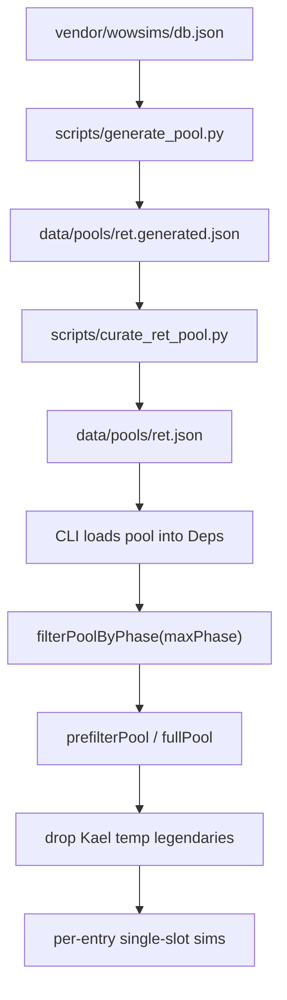

# Where rank candidates come from

Audience: engineers (and a light game SME pass on the equip/loot claims).  
Spec today: **ret** only. Rank entrypoint: `rankUpgrades` in `packages/core/src/rank.ts`.

This describes **which items are eligible to be simmed**, not how ΔDPS is computed after that.

---

## Short answer

A **candidate** is one row from the curated pool file `data/pools/ret.json`, after:

1. **Phase filter** — `phase <= maxPhase` (inclusive).
2. **Optional EP prefilter** — top ~80 by stored pool EP, unless `--full-pool`.
3. **Kael temp legendary strip** — encounter-only TK legendaries removed again at rank time.

Each surviving row is simmed as a **single-slot swap** against the player’s logged gear (rings/trinkets try both slots). Owned identity short-circuits to Δ0. Socketed candidates get a **local gem fill** on the swapped item only.

Nothing outside that pipeline “suggests” items at rank time — no live Wowhead scrape, no BiS guide import, no armory “similar items.”

---

## Pipeline stages (build → rank)

### 1. Generate — EP top-N per slot from wowsims DB

**Script:** `scripts/generate_pool.py` → `data/pools/ret.generated.json`.

For every item in pinned `db.json`:

| Gate | Rule (ret) |
|------|------------|
| Slot known | wowsims `type` maps to our 14 slots |
| Quality | rare+ (`quality >= 3`) |
| Armor body slots | **plate only** (`armorType == 4`) — head/shoulder/chest/wrist/hands/waist/legs/feet |
| Weapon | **two-hand only** (`handType == 4`); excludes staff (unequippable) and polearm (**product filter**, not an equip rule — ret can use 2H polearms) |
| Ranged | **libram only** (`rangedWeaponType == 7`) — not bows/guns/thrown |
| Kael temps | IDs in `KAEL_TEMP_LEGENDARY_IDS` excluded here too |
| EP | `ep_score(item stats, ret P2 EP weights) + weapon_white_damage_EP`; drop if ≤ 0 |

Then **per slot**, keep the **top 12** by that EP (`TOP_N = 12`).

**Game implication:** leather/mail BiS (e.g. Belt of One-Hundred Deaths) **never** enter via generate alone — only plate armor does. Cross-armor chase pieces must be **forced in curation**.

**Weapon white-damage EP:** stats-only EP under-ranks real 2H sticks vs hit-stat rares; generator adds a white-DPS proxy (`WEAPON_DPS_EP = 12`).

Sources are best-effort from `db.json` `sources[]` (may be `null` → curation must fill).

### 2. Curate — sources + FORCE pins + trim to 12/slot

**Script:** `scripts/curate_ret_pool.py` → `data/pools/ret.json`.

1. Take generated rows; attach `source` from db or the hand `HAND` map. **Refuse to ship** any row still missing a source.
2. **`FORCE` list** — known-good pieces that must appear even if EP ranked them out (or generate could not include them). For each slot: `FORCE` rows first, then EP-sorted remainder, then **cut to 12**.
3. Notable FORCE examples (not exhaustive): Belt of One-Hundred Deaths, Bow-stitched Leggings, Cloak of Darkness, Band of Devastation, Soul Cleaver, Cataclysm’s Edge, Gorehowl, World Breaker, Lionheart, Torch, several librams, etc.

**Game implication:** community “must chase” items that fail plate/EP gates only show up if someone put them in `FORCE` (or they already survived generate’s top-12).

Committed pool is what rank reads. Regenerating without updating FORCE/HAND can drop pins or leave null sources.

### 3. Rank-time filters

**Loaded by CLI** into `Deps.pool` (core stays pure).

| Step | Function | Effect |
|------|----------|--------|
| Phase | `filterPoolByPhase` | Keep `entry.phase <= input.maxPhase` (inclusive). Same idea as gem palette phase. |
| Prefilter | `prefilterPool` | Default: sort by pool `ep`, keep top **80**. `--full-pool` / `fullPool: true`: keep all phase-passing rows. |
| Kael strip | `isKaelTempLegendary` | Defense in depth vs generate; Twinblade of the Phoenix (29993) is **not** on this list (persistent Kael 2H). |

After that, the list is the **candidate set** for sims.

On a recent slamaltman P3 full-pool run: curated pool size ~164 phase-filtered; ~104 candidates simmed (+1 baseline) with full pool.

### 4. What happens per candidate (not “who is a candidate,” but affects the list’s meaning)

- **Equipped same item in that slot** → ΔDPS **0**, no re-sim (avoids gem-strip fake losses).
- **Else** → replace that slot’s item; **fill sockets** on the new item (`fillCandidateGems`); keep enchant if the new item’s slot is enchantable; compose into the pinned raid-sim skeleton; sim; Δ = candidate DPS − baseline DPS.
- **Finger / trinket** → try both equipment slots; report best; may attach `replacesEquipped` / `alternateSlot`.
- **Ranking / cutoff / HTML** — after sims; does not add new item IDs.

Gem fill is **not** a full-set optimizer: local to the swapped piece; gem-fill EP zeros hit/expertise softcaps and may prefer strength reds over colour-matched hit oranges.

---

## What does *not* determine the candidate list

- WCL log contents (except which **baseline** gear is worn).
- Live wowsims website “similar items” / gear planner suggestions.
- Community BiS sheets (except insofar as a human encoded them into `FORCE` / curation).
- `maxPhase` alone does **not** pull P3 leather into an empty FORCE — generate still plate-only.
- The EP prefilter does **not** invent items; it only truncates the curated pool when not full-pool.

---

## Worked examples

| Item | Why it can appear | Why it might not |
|------|-------------------|------------------|
| Onslaught Greaves (plate T6) | Generate EP top-12 legs + source HAND/token | Phase > maxPhase; trimmed by prefilter if low EP and not full-pool |
| Belt of One-Hundred Deaths (leather) | **FORCE** in curate (generate cannot add leather waist) | Removed from FORCE / curation regression |
| Netherstrand Longbow | Should **not** — Kael temp + ranged not libram | Bug if it appears |
| Tempest of Chaos (1H caster) | Should **not** — not 2H | Would need mistaken FORCE / handType bug |
| Twinblade of the Phoenix | Generate 2H path and/or FORCE; not Kael-temp banned | Phase / prefilter |
| Arena plate | Generate + PvP source in HAND | Still candidates; HTML may separate PvP shortlist for reading |

---

## Knobs operators actually flip

| Knob | Where | Candidate effect |
|------|-------|------------------|
| `--max-phase N` | CLI / `RankInput.maxPhase` | Phase gate + gem palette phase |
| `--full-pool` | CLI / `RankInput.fullPool` | Skip top-80 EP prefilter |
| `data/pools/ret.json` | curate output | Authoritative ID list |
| `FORCE` / `HAND` | `curate_ret_pool.py` | Pins + sources |
| Generate filters | `generate_pool.py` | Who can enter before FORCE |
| `KAEL_TEMP_LEGENDARY_IDS` | generate + `kael-temp.ts` | Encounter-only weapons |

---

## Game claims for SME spot-check

Please confirm or correct these as **TBC Anniversary ret** facts (not pipeline opinion):

1. Ret **armor** chase for body slots is normally **plate**; some BiS pieces are **leather** (e.g. Vashj belt) and must be considered deliberately.
2. Ret **ranged** slot is a **libram**, not a bow/gun.
3. Ret *can* equip 1H weapons, but this product’s weapon ladder is **two-hand** main-hand sticks only (not a full 1H+shield dual-wield-style path).
4. Kael’thas **legendary weapons** are encounter-only and are not normal persistent upgrades; Twinblade of the Phoenix is a normal 2H drop from that boss and *is* keepable.
5. A single-item “upgrade list” is always relative to **what the character already wears**, not a naked BiS sheet.
