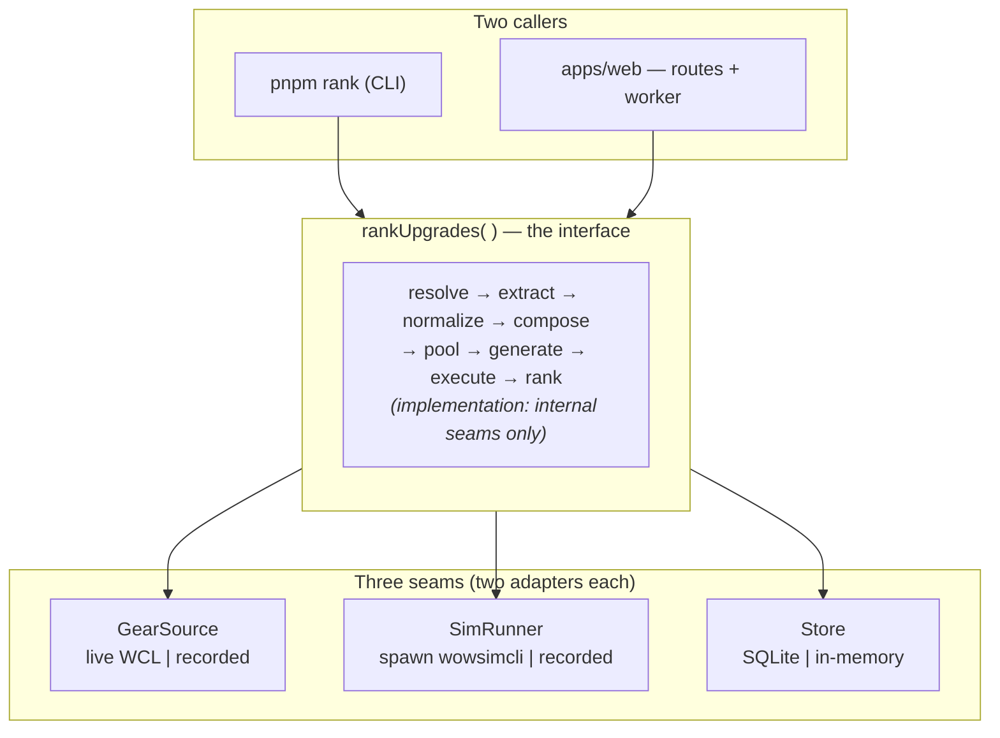

# This Your BiS — Architecture & Delivery Plan

**Status:** for review, pre-implementation
**Supersedes:** agent 1's `ARCHITECTURE.md`, agent 2's `tbc_upgrade_ranker_8c29d59f.plan.md`
**Last updated:** 2026-07-26
**Phase 0 findings applied:** [`docs/phase0-findings.md`](docs/phase0-findings.md). Sections carrying a verified fact are marked **[P0]**. Phase 0's gate is **closed** — see §14 and [`docs/verification-log.md`](docs/verification-log.md).
**Domain review applied:** [`PLAN-REVIEW.md`](PLAN-REVIEW.md). Corrections carry an **[Rn]** marker naming the finding. Nothing in that review changed §3's architecture — the deep module, the three seams and the content hash all survive intact; the corrections landed in the pool, the preset pipeline, the gem solver, the statistics and the display layer.

---

## 0. What this document is

A merge of the two independent drafts, arbitrated with the deep-module vocabulary from `/codebase-design`: **module**, **interface**, **implementation**, **depth**, **seam**, **adapter**, **leverage**, **locality**. Those words are used precisely throughout — "interface" means *everything a caller must know*, not just a type signature; "seam" means a place behaviour can be altered without editing in that place.

Where the drafts agreed, this document states the decision once and moves on. Where they disagreed, §1.2 records the call and the reason.

**The one structural argument in here:** both drafts described the engine as an eight-stage pipeline and then drew eight boxes. Eight stages is a correct description of the *implementation* and a bad description of the *interface*. This plan keeps the eight stages exactly as drafted and refuses to make them modules. See §3.

---

## 1. Decisions

### 1.1 Locked

| | |
|---|---|
| Product question | "What should I want to drop tonight?" — ranked single-item swaps against real logged gear |
| First spec | **Retribution paladin**. No content tier is baked in — see the next row |
| Content tier | **A user input, never a build target** (review R2). `maxPhase: 1–5`, filtered **inclusively**. The default is **not hand-maintained and not inferred from the player's log** — it is wowsims' own `CURRENT_PHASE`, synced and pinned (§8.5). Currently **2** |
| Second spec | Feral cat — and it is a **gate**, not a backlog item (§14, Phase 2) |
| Delivery | Phases with recorded exit gates; no phase N+1 before N's gate is written down |
| Repo | **this one** (`tbc-gear-prio`); rename later if the product name sticks |
| Runtime | One always-on Node container. Not serverless — the sim is a ~50 MB native binary that needs process spawn and multiple cores |
| Web | TanStack Start (Nitro `node-server`) + Tailwind v4 + shadcn |
| Simulator | Pinned `wowsimcli`, protojson in/out |
| Persistence | SQLite on a volume (Drizzle + `better-sqlite3`). No Redis, no separate worker process, no queue service |
| Meta gems | Always kept active, via minimum-EP-loss repair — not re-optimization |
| Output | Shortlist + cutoff. The top three rows are the product |
| Views | Pin-BiS, raid/boss filter, slot grouping, hide-owned. **Display-only** — outside `RankInput`, outside `contentHash` (§4.1) |

**Terminology [R2].** "Phase" was overloaded in earlier revisions. Delivery steps are now **Stage N** (§14) and the game's content is a **tier**; see [`CONTEXT.md`](CONTEXT.md) for the glossary and the banned-words list. R2's original fix — capitalisation alone — failed, and was replaced by the rename.

**Not the goal:** full BiS solving, parse analysis, rotation/talent optimization, or any claim that baseline sim DPS equals the player's logged DPS.

### 1.2 Arbitrated disagreements

| Question | Draft 1 | Draft 2 | Call |
|---|---|---|---|
| First spec | Feral cat | Ret (locked) | **Ret.** Ret needs no *behavioural* disambiguation — no uptime or cast heuristics, which is the expensive part. Feral's value is as the *second* spec: it's what proves the spec seam is real rather than hypothetical (§5.4). **[P0] The original reason given here was wrong** and is corrected in §5.2: WCL exposes no spec-level label for any class, so ret still needs a cheap classification step |
| Proto types | Generate from pinned `.proto` | Hand-written TS types | **Generate.** §8.1 |
| Spec presets | `decodelink` a share link, commit the JSON | Port/vendor wowsims preset data | **Decode.** Biggest scope collapse in the plan. §8.2 |
| Candidate pool | Generate-then-curate | Curate-then-EP-shadow-check | **Same idea, better workflow in draft 1.** §8.3 |
| Package split | Not specified | `core` / `wcl` / `sim` / `db` (rev 1), `core` / `wcl` (rev 2) | **One package + one app.** §5.1, deletion test |
| WCL port shape | Not specified | `WclClient` with `encounterRankings`/`combatantInfo`/`tableQuery`/`rateLimit` | **Rejected.** Transport-shaped and shallow. Replaced by `GearSource`. §5.2 |
| Dedupe | `dedupeHash` on gear+settings+pool | Idempotent job create on input hash | **Merged and generalized** into one content-address. §7 |
| Routes | Three (`/`, `/c/…`, `/run/$id`) | Two (`/`, `/r/$jobId`) | **Three.** The character route is where trust is won. §12 |

---

## 2. Product framing (copy constraints, binding on the code)

- The tool answers *what to want tonight*, not *what your endgame set is*.
- Curated BiS membership is a **tag, a tiebreaker, and an opt-in display sort — never a pool filter.** (Review R15 amended this line: a pin is stronger than a tiebreaker, it's a primary sort key. The spirit survives — nothing is excluded and no delta changes — but the old wording made §12's pin toggle read as a violation of a stated product constraint.)
- Baseline absolute DPS is labelled "sim baseline" everywhere. Never "your DPS".
- Every number is reproducible: sim version, seed, iterations, and encounter profile are one click away from the result.
- **No view changes a number.** Every filter, pin, grouping and cutoff is a re-render of an existing `Ranking`. If a control would change a delta, it belongs on `RankInput` and in `contentHash` instead, and the run has to be re-simmed. This is the line that keeps the display layer honest.

These are architectural constraints, not marketing. They're why `Ranking` carries `assumptions` and `substitutions` as required fields rather than optional decoration (§4).

---

## 3. The structural argument

Both drafts drew this:

```
Resolve → Extract → Normalize → Compose → Pool → Generate → Execute → Rank
```

That is an accurate picture of the implementation. It becomes a problem the moment those eight boxes turn into eight modules with eight exported functions and eight sets of I/O types, because then the *interface* of the engine is the union of all eight — eight signatures, seven intermediate types, and a required ordering the caller has to know. That's a large interface over a thin implementation at each step: **shallow**, by definition.

Apply the deletion test to `Extract` as a module: delete it, and its complexity doesn't reappear across N callers — it has exactly one caller, forever, and always the same one. Same for `Compose`, `Generate`, `Normalize`. These are *steps*, not modules. Steps belong inside an implementation.

So: **one deep module, three seams.**



Why this shape earns its keep:

- **Leverage.** A caller learns one function and gets the entire engine. The CLI is ~40 lines. The web worker is ~40 lines. Both are genuinely thin, which is the point of Phase 1's "no web polish before a ranking you trust" rule — the web shell can't be where the logic hides if there's nowhere for it to hide.
- **Locality.** A change to how rings are collapsed, or how ties are grouped, touches one file and is verified in one place. Neither caller notices.
- **The interface is the test surface.** With the recorded adapters at all three seams (§6), the full engine runs deterministically in a unit test, offline, in milliseconds, with no WCL points spent and no 60-second sim. That single fact is worth more than every other testing decision in this plan.

The eight stages still exist. They're functions in one package with **internal seams** — private to the implementation, used by the module's own tests, not exposed through the interface.

---

## 4. The interface

```ts
// packages/core — the entire public surface
export async function rankUpgrades(
  input: RankInput,
  deps: Deps,
  onProgress?: (p: Progress) => void,
): Promise<Ranking>

export type RankInput = {
  character: CharacterRef            // { region, realm, name }
  spec: SpecId                       // 'ret' for v1
  maxPhase: ContentPhase             // 1–5, INCLUSIVE filter. Default DEFAULT_MAX_PHASE
  fight?: FightRef                   // omitted = most recent qualifying kill
  race?: Race                        // override; defaults to the preset's. NOT
                                     // readable from WCL (P0) — and it changes the
                                     // sim, so it is an input and it is hashed
  iterations?: number                // default 5000
  seeds?: number[]                   // default [<fixed>]; >1 enables paired replication (§10)
  fullPool?: boolean                 // skip the rank-time EP prefilter (§8.3), sim everything
}

export type Deps = {
  gear: GearSource                   // the three seams (§5)
  sim: SimRunner
  store: Store
  clock: () => Date
  raidSimSkeleton: RaidSimRequest    // per-spec configuration the engine cannot
  epWeights: EpWeights               // synthesise. Data, not ports — see ADR-0019
  gemPalette?: readonly GemEntry[]
  pool?: readonly PoolEntry[]
}

export type Progress =
  | { stage: 'resolving' }
  | { stage: 'reading-gear' }
  | { stage: 'building-pool' }
  | { stage: 'simming'; done: number; total: number }
  | { stage: 'ranking' }
```

Everything a caller must know, stated as part of the interface:

- **Idempotent by content.** Two calls whose `contentHash` matches (§7) return the same `Ranking`, from cache, without spawning a sim. **[ADR-0019]** A hit still resolves the fight and reads gear — the hash covers the logged gear, which is not known until then — so it fires `resolving`, `reading-gear`, `composing`, `building-pool`, `ranking`, not once. What is guaranteed: **no sim runs, and the last event is `ranking`**, so a caller that opened a progress view always gets an event to close it.
- **`Deps` carries the three seams plus per-spec configuration** — `raidSimSkeleton`, `epWeights`, `gemPalette`, `pool`. The last two are data rather than ports, and are hashed into `contentHash` from `deps`; cache correctness comes from a field being *in the hash*, not from which parameter declares it (**[ADR-0019]**, ticket 23 item 3).
- **Ordering.** None. There is one entry point.
- **`maxPhase` is inclusive, and inclusive is the load-bearing word** (review R2). `poolItems.filter(i => i.phase <= input.maxPhase)`. At `maxPhase: 2` the player still sees Karazhan drops and Badge of Justice gear, much of which is still competitive at T5; a per-tier pool would have wrongly excluded all of it. The same filter applies to the gem palette (§9), so a user simming at 2 is never told to socket an epic gem. It is in `contentHash` and in `assumptions`, displayed as *"candidates: phase ≤ 2"*.
- **Display options are not inputs.** Pinning, filtering, grouping and hiding-owned live in `ViewOptions` (§4.1), never here. Anything on `RankInput` changes a number and forces a re-sim; anything on `ViewOptions` cannot and does not.
- **Error modes.** Throws `RankError` with a discriminated `kind`: `character-not-found`, `no-qualifying-fight`, `gear-unreadable`, `meta-unsolvable`, `sim-failed`, `wcl-budget-exhausted`. Each maps to a specific UI empty-state; that mapping is the whole reason the kinds are enumerated rather than free-text.
- **Cost.** **[P0]** Stated in **points**, not queries (per review R9): a full resolve — character → recent reports → `CombatantInfo` → buffs table — measured at **~10.6 points** against a **3,600 points/hour** budget, i.e. ~340 cold resolves per hour. 0 on gear-cache hit. Plus up to `|simmed| × |seeds| + 1` sim runs (0 on ranking-cache hit), where `|simmed|` is the pool *after* the rank-time EP prefilter — ~80 of a ~180-entry pool by default, or the whole pool under `fullPool` (§8.3). Tens of seconds to a couple of minutes. This is a **job**, and the interface says so by taking `onProgress`.
- **Purity.** No filesystem, no network, no `process.env`, no React, no `console` — all I/O crosses one of the three seams. Enforced by lint rule, not by good intentions.

```ts
export type Ranking = {
  contentHash: string
  character: CharacterRef & { spec: SpecId; race: Race }   // race ASSUMED, not read
  fight: {                           // renamed from `source` — that name now belongs
    reportCode: string; fightId: number; encounterName: string
    killedAt: string; route: 'ranked' | 'report-events'
  }                                  // to ItemSource, and two `source` fields on one
                                     // screen is exactly the confusion we don't need
  baseline: { dps: number; stdev: number; metaAdjusted: boolean }
  caps: CapState                     // see below (review R8)
  assumptions: Assumptions           // encounter, presetId, simVersion, seeds, iterations, maxPhase
  substitutions: Substitution[]      // every field we invented rather than read
  items: RankedItem[]
  cutoff: { absDps: number; pct: number }
}

export type RankedItem = {
  rank: number | null                // null when below cutoff. ALWAYS absolute — never
                                     // renumbered inside a filtered view (§12)
  itemId: number; name: string; slot: SlotId
  slotChoice?: SimSlotName           // which ring/trinket slot won, by name
                                     // ('finger2', not 'b') — amended 2026-08-02
  source: ItemSource                 // required, curated (§8.3). Drives the raid filter
  deltaDps: number; deltaPct: number
  se: number; seMethod: 'independent' | 'paired-replicate'
  tieGroupId?: string
  bisTags: Array<'BiS' | 'Alt' | 'Realistic'>
  setBonusNote?: string
  hitDriven?: boolean                // this item's gain is mostly hit rating, and the
                                     // player is under cap — see CapState
  owned?: boolean                    // already equipped in the logged set (§8.3)
  belowCutoff: boolean
}

// Amended 2026-08-02 (pre-merge review, Spec S1). `slotChoice` was `'a' | 'b'`. Neither
// the report nor a caller can tell which ring 'a' is, and the value leaked into the HTML
// verbatim when the paired slot was empty and there was no worn item to name. It is now
// the sim slot name, which `simSlotsForPoolSlot` already returns — a rename of the same
// fact, not a new one. `SimSlotName` is a real union (pool.ts) that rejects an unknown
// name; verified by assigning "not-a-real-slot" and getting TS2322.

// Review R8. Ret's dominant gearing constraint is the 9% yellow hit cap (~142 rating:
// 8% base miss vs a level 73 boss, plus 1% suppression). Stat value is DISCONTINUOUS
// there — hit is often the best stat on the sheet right up to the cap and worth ~zero
// past it. So if a player is 20 rating short, three items each carrying 20 hit each sim
// as a large gain, and taking one erases most of the other two's value.
//
// Per §2's scoping rule that is CORRECT behaviour and we do not model combinations. But
// it is a known misreading trap, and the subtraction is free, so we flag it rather than
// let the user act wrongly on a correct ranking.
export type CapState = {
  hit: {
    rating: number; capRating: number; gap: number   // gap > 0 = under cap
    assumedRace: Race                                // NOT read from the log — see below
    capUncertainty: number                           // ±16: Heroic Presence is
                                                     // unobservable (P0)
  }
  expertise: { rating: number; capRating: number; gap: number }
}
```

`substitutions`, `assumptions` and `caps` are **required**, not optional. A `Ranking` you can't audit is not a `Ranking` — making them non-nullable puts that in the type system rather than in a code review checklist.

**Take the rating conversions from upstream rather than deriving them.** `ui/core/constants/mechanics.ts` (at the pinned commit) carries `PHYSICAL_HIT_RATING_PER_HIT_PERCENT = 15.769233` and the crit/haste/expertise equivalents; none of these constants currently exist in `packages/core/src`. They corroborate this section exactly — `9 × 15.769233 = 141.92`, i.e. the ~142 cap above, and 1% ≈ 15.77, i.e. `capUncertainty: 16`. Copy the values with the pin SHA in a comment rather than importing across the vendor boundary: that file is level-scoped (`CHARACTER_LEVEL = 70`, `BOSS_LEVEL = 73`) and would silently change meaning if the pin ever moved to a later-expansion upstream. Note also that `SPELL_HIT_RATING_PER_HIT_PERCENT` (12.615385) differs from the physical constant — a ret hit cap must use the physical one. See [`docs/plans/wowsims-reuse/take-list.md`](docs/plans/wowsims-reuse/take-list.md) §2.

**[R8, P0] The hit cap moves with race — and race is NOT retrievable from Warcraft Logs.** This was probed properly and the answer is a clean no: no race field on `ReportActor`, none on the `CombatantInfo` event, and `Character.gameData` returns *"This game does not support cached game data."*

The promising fallback also failed, and it's worth recording why, because it would have been *better* than race. TBC's *Heroic Presence* is a **party-wide** +1% hit aura — so a non-Draenei grouped with a Draenei still gets it, and reading race alone gives the wrong answer in both directions. The buff is the ground truth that race only proxies for. It is **not tracked**: absent from 6/6 reports across two zones, while the same tables carry 163 auras including passive party auras of identical shape (*Blood Pact*, *Unleashed Rage*). And the sample isn't ambiguous — both fixture characters are **Alliance**, every Alliance shaman in TBC is a Draenei, and those raids are full of shaman auras. There were Draenei present. The aura still never appears.

**So the exact yellow hit cap is not derivable from a log, and the design has to stop pretending otherwise:**

1. `CapState.hit` carries **`assumedRace`** and **`capUncertainty: 16`** rather than presenting one exact number.
2. Race defaults to the preset's, is recorded as a **standing substitution** (§9's first tier — it belongs with talents and consumes, which are invented on every run for the same reason), and is **user-overridable** with a single control on `/c/…`. A race dropdown is a *fact* about the character, not the kind of user context §1.1 rules out — the tool asks for region, realm and name already.
3. The banner is phrased to carry the uncertainty: *"~20 rating under the hit cap, assuming no Heroic Presence in your party"* — not a precise figure that will be quietly wrong for anyone grouped with a Draenei.

This makes the banner **more** valuable, not less. We can't pin the cap exactly, which is precisely why showing the assumption beats showing a confident number.

### 4.1 `ViewOptions` — the second export, and why it's safe

```ts
export function applyView(r: Ranking, v: ViewOptions): RankedItem[]

export type ViewOptions = {
  pinBis?: boolean                   // pin curated-BiS members to the top (default off)
  raid?: string                      // 'all' | zone key — see ItemSource (§8.3)
  boss?: string                      // 'all' | boss name, within the selected raid
  groupBy?: 'rank' | 'slot' | 'raid'
  hideOwned?: boolean                // hide items already equipped
}
```

A pure function over an existing `Ranking`. No seams, no I/O, no sim. That is the entire justification for it being the module's second export rather than duplicated logic in the CLI and the web view — and it's why §5.1's layout now names two exports rather than one.

Three consequences, all of which are easy to get backwards:

- **Toggling is instant.** A re-sort or re-filter of data already in hand. No re-sim, no cache invalidation, no new `contentHash`.
- **The pinned group is still ordered by `deltaDps`.** wowsims' curated sets are 17 entries in fixed *slot* order and carry no ranking information whatsoever. Slot order is membership data, not priority data, and must never leak into display order. `sortKey = [pinBis && bisTags.includes('BiS') ? 0 : 1, -deltaDps]`.
- **Pinned rows will sometimes show negative deltas, and that is correct.** An item is BiS *as a member of a whole optimized set*. Dropped singly onto this player's gear it can genuinely lose DPS — most often by breaking a tier 2-set or 4-set bonus, or by being hit-light for a player under the cap. Keep the signed delta visible on pinned rows; never let the pin imply "upgrade". `setBonusNote` explains the common case.

**The toggle degrades to disabled, it does not silently do nothing.** Ret has three curated sets in `tbc-new` and they stop at P2, so above `maxPhase: 2` there is nothing to pin. Hide or disable the control when no set data exists for (spec, maxPhase) — a toggle that visibly does nothing reads as a bug.

`BiS` is pinned by default; `Alt` and `Realistic` exist precisely to describe *attainable* alternatives and pinning them would swamp the group. The tags are already per-item, so a three-way selector is a later UI change with no data change.

---

## 5. The seams

Three, and only three. The discipline being applied: *one adapter is a hypothetical seam; two adapters is a real one.* Each seam below has two adapters that both actually get built, in Phase 1, and both actually get used.

### 5.1 What is not a seam

`packages/sim` and `packages/db` (draft 2, rev 1) fail the deletion test. Delete `packages/sim`: the complexity doesn't spread across callers, it lands back in one file — `spawn`, two temp files, `JSON.parse`. Delete `packages/db`: four table definitions move into core. A package boundary with nothing varying across it is indirection with a `package.json` attached, and it costs you a build step, a version, and a jump every time you read the code.

Final layout is **one package and one app**, and the split between them is real because it has two callers:

```
tbc-gear-prio/
  apps/web/                     TanStack Start: 3 routes, server fns, in-process worker
  packages/core/                the deep module + its adapters + the CLI
    src/
      rank.ts                   ← the interface (§4). With view.ts, the only exports.
      view.ts                   ← applyView (§4.1). Pure; touches no seam.
      stages/                   resolve, extract, normalize, compose, pool, generate, execute, rank
      gems/                     meta conditions + min-EP-loss repair
      slots.ts                  the 19→17 WCL/sim slot mapping (§8.4)
      seams/
        gear-source.ts          port + WclGearSource + RecordedGearSource
        sim-runner.ts           port + CliSimRunner  + RecordedSimRunner
        store.ts                port + SqliteStore   + MemoryStore
      proto/                    GENERATED — do not edit (§8.1)
      cli.ts                    `pnpm rank --region eu --realm X --character Y`
    test/
      fixtures/                 recorded WCL payloads + sim results, committed
  data/
    presets/ret/p2.individual-sim-settings.json
                                decoded share link — talents, APL, buffs, consumes,
                                encounter. One per (spec, tier); selected by maxPhase.
                                The filename states which protobuf message it holds,
                                because IndividualSimSettings ≠ RaidSimRequest (§8.2, R6)
    pools/ret.json              candidate pool — ONE FILE PER SPEC, not per tier (R2).
                                Each entry carries its own `phase`; filtering happens at
                                rank time. Curation accumulates instead of being redone
                                every tier. Each entry also carries a required `source`
    bis-tags/ret.json           BiS / Alt / Realistic membership, per (tier, variant)
    items/index.json            GENERATED from db.json — id → name, slot, sockets,
                                socketBonus, enchantable, setId, phase, unique,
                                requiredProfession. Every item, not just pool
                                members (§9 [P0])
    gems/palette.json           GENERATED from db.json — id, colour, stats, phase,
                                unique, requiredProfession (§9, R4)
    wowsims.lock.json           COMMITTED — pinned upstream tag, commit, per-file
                                sha256, and CURRENT_PHASE. The source of
                                DEFAULT_MAX_PHASE (§8.5)
  scripts/
    sync_wowsims.py             pin/verify/update the upstream inputs (§8.5)
    verify_fixture.py           resolves a captured fixture against db.json —
                                slot mapping, enchant namespace, gems (§8.4)
  wcl_probe.py                  Phase 0 WCL probe. --raw-out writes the fixture
    proto/                      pinned .proto files from the wowsims release
  vendor/wowsimcli-<version>-<platform>   gitignored; fetched by script
  docs/
    adr/                        decisions that must not be re-litigated
    phase0-findings.md
    verification-log.md
```

### 5.2 `GearSource` — true external (WCL)

Draft 2 proposed `WclClient { encounterRankings, combatantInfo, tableQuery, rateLimit }`. Rejected: that's four methods, each shaped like a WCL GraphQL operation, which means the caller has to know WCL's query model, its spec-name strings, its ranked-vs-events distinction, and its rate-limit accounting. The seam leaks the vendor straight through.

The deep version hides all of it:

```ts
export interface GearSource {
  findFights(c: CharacterRef, spec: SpecId): Promise<FightSummary[]>
  readGear(f: FightRef): Promise<LoggedGear>   // items, gems, enchants, talentPointsByTree, provenance
}
```

Two methods. Behind them: OAuth2 client-credentials with token reuse, the classic-vs-retail endpoint choice, `encounterRankings` with `includeCombatantInfo`, the `report.events(dataType: CombatantInfo)` fallback when there are no ranked kills, **spec classification (below)**, `rateLimitData` accounting, retry/backoff, and the permanent immutable gear cache. None of that is in the interface, because none of it is something the caller can act on.

**[P0] Endpoints, confirmed against the live API:**

| | |
|---|---|
| Token | `https://www.warcraftlogs.com/oauth/token` — the shared endpoint, *not* a classic-specific one |
| GraphQL | `https://classic.warcraftlogs.com/api/v2/client` — the only one that resolves TBC data |
| Credentials | `WCL_CLIENT_ID` / `WCL_CLIENT_SECRET` (§13) |

`Character.recentReports`, `Character.encounterRankings`, `Character.zoneRankings`, `EventDataType.CombatantInfo`/`.Buffs`/`.Casts` and `TableDataType.Buffs` are all present in the schema, so both the resolve route and the events-fallback route are viable as drafted.

**[P0] Spec classification — WCL has no spec label.** The actor-level `subType` field returns **class-level strings only** (`Paladin`, `Druid`, `Warrior`, …). There is no `Retribution` or `Feral`, for any class.

- **Classifier (source of truth):** `CombatantInfo.talents` — a three-entry array of `{id, icon}` where **`id` is points spent in that tree** (`[{id:21},{id:40},{id:0}]` reads 21/40/0). The `talentPoints` field the plan assumed is **absent**; this array is where the distribution actually lives. Spec falls out of whichever tree holds the plurality (`classifySpec` in `packages/core/src/spec.ts` — Paladin-only today; other classes return `unsupported-class` until a fixture verifies their tree order).
- **`CombatantInfo.specID` is unusable on TBC Anniversary** in our fixtures: **every** combatant has `specID: 0`, including confirmed Ret (slamaltman `5/11/45`). Do **not** branch on `specID` alone — treating `0` as Holy (or any real spec) mis-specs the whole raid. Re-probe before ever trusting it; until then it is noise.

This is a small addition to the normalize stage, not a structural one, and it stays behind `GearSource` where the rest of WCL's vocabulary already lives. It applies to **every** spec including ret — see §5.4.

Per review R7, the field on `LoggedGear` is named **`talentPointsByTree: [number, number, number]`**, derived from that array, and is documented as *spec-detection input only, never a sim input*.

**[R18] Normalize at the seam boundary — WCL's raw `talents` array must not escape the adapter.** A field called `id` nested under a field called `talents`, which actually means "points spent", is a trap with a very high hit rate: `talents.map(t => t.id)` returns `[21, 40, 0]`, which looks entirely plausible as a list of talent identifiers and is nonsense. `GearSource` returns `talentPointsByTree` and nothing else; there is no code path by which the WCL shape reaches a caller who could misread it.

**[R8, P0] `race` is NOT here, because WCL does not have it.** Probed and settled — see §4 and [`docs/verification-log.md`](docs/verification-log.md). `LoggedGear` must not carry a `race` field at all, not even an optional one: the whole lesson of R18 is that a field which *looks* readable will be read, and a silently-wrong race shifts every hit-adjacent ranking. Race enters through `RankInput`, where its status as an assumption is explicit.

> **Caution on `specID`.** TBC has no native client specialization ID. On Anniversary logs the field is present but **always 0** in captured fixtures, so it is not even a useful cross-check today. **Talent-tree plurality is the only classifier.**

**Upstream has a WCL importer — read it, don't port it.** `ui/raid/components/importers/raid_wcl_importer.tsx` (at the pinned commit) is a working 776-line WCL client, and it is worth reading for the report-scoped GraphQL query shapes and the `gear[] → ItemSpec` field mapping. It is **not** a shortcut past this section: it is report+fightID-first with no character-first discovery (`encounterRankings`/`recentReports` appear nowhere in it), and it classifies spec from an `icon` dash-suffix that is **absent from our Anniversary fixtures** — on our data it throws. Its talent handling also reads `talents[].guid` where our shape carries `id`, i.e. the [R18] trap below, silently. Only ~10% of it is framework-independent. **Everything decided above stands**; see [`docs/plans/wowsims-reuse/take-list.md`](docs/plans/wowsims-reuse/take-list.md) §1 for the fixture evidence and repro commands.

- `WclGearSource` — production. Also **records** every response to `test/fixtures/` when `RECORD_FIXTURES=1`.
- `RecordedGearSource` — replays those fixtures. Used by every test and by `pnpm rank --offline`.

The recorder is what makes the second adapter free: you don't write fixtures by hand, you capture them once from a real character and commit them.

### 5.3 `SimRunner` — true external (native binary)

```ts
export interface SimRunner {
  version(): Promise<string>
  run(req: RaidSimRequest, opts: { seed: number; iterations: number }): Promise<SimObservation>
}
```

- `CliSimRunner` — writes protojson to an OS temp file, spawns `wowsimcli sim --infile --outfile`, enforces a timeout, kills orphans on abort, parses the result, stamps `version`. Resolves the binary per platform (`win32-x64` for the dev machine, `linux-x64` for the container) — the drafts both glossed this and it will bite on the first deploy.
- `RecordedSimRunner` — keyed by `hash(request) + version + seed + iterations`, replays committed results.

Concurrency lives in the caller, not the runner: `SIM_CONCURRENCY` (default `cores - 1`). Sims are child processes, so the Node event loop is idle while they burn CPU — which is exactly why the in-process worker is sufficient and a separate worker service is not needed.

### 5.4 `SpecProfile` — the seam that is *not* a port

Everything spec-specific — talents, APL, buffs, consumes, EP weights, gem palette, meta policy, enchant defaults, encounter defaults — is **data**, loaded from `data/presets/<spec>/<tier>.individual-sim-settings.json`. There is no `SpecStrategy` interface and no per-spec code path.

This is the payoff of §8.2, and it's why feral is a Phase 2 *gate* rather than a Phase 4 item: adding a spec should be dropping in a JSON file and nothing else. If feral requires a code change beyond the spec-detection layer, the seam was in the wrong place and we want to find that out before the web shell exists, not after.

**[P0] Two levels of spec detection, not one.** The plan previously treated spec detection as a feral-only concern. It isn't:

1. **Classification — every spec, ret included.** Derive the spec from `talentPointsByTree` plurality (§5.2). Cheap, always runs. Do not use `specID` (0 on Anniversary).
2. **Behavioural disambiguation — feral only.** Bear vs cat can't be separated by talents, so it needs form uptime. **[P0] Confirmed available:** the `Buffs` table returns `Dire Bear Form`, `Bear Form`, `Cat Form` and `Moonkin` entries for TBC fights, so the Phase 2 gate is unblocked on data.

Per review R12, the rule for (2) is **declared in the preset**, e.g. `{ disambiguate: { buff: 'Bear Form', maxUptime: 0.2 } }`, and evaluated behind `GearSource.findFights` as a per-spec *confidence* field. Neither level is a branch in the engine.

**[P0] Talent presets are one default per spec/tier, not closest-variant.** Because the raw payload carries only per-tree totals (21/40/0), there is no way to match a logged build against specific preset variants. This was already the plan's fallback; it is now known to be the only option, so nothing should be built expecting finer granularity.

### 5.5 `Store` — local-substitutable

One port, not three (draft 2 proposed `JobStore` + `CacheStore` + gear cache separately):

```ts
export interface Store {
  get<T>(key: string): Promise<T | undefined>
  put<T>(key: string, value: T): Promise<void>
  job: { create(...), update(...), read(id): Promise<Job | undefined> }
}
```

Everything cacheable is content-addressed (§7), so the cache half of the interface is a keyed blob store — there is nothing to gain from three differently-named ports over the same two operations. `SqliteStore` for production; `MemoryStore` for tests. Table shape in §11.

---

## 6. Testing strategy

Replace, don't layer. Because all three seams have recorded adapters, the real test is at the module's interface:

```ts
const ranking = await rankUpgrades(
  { character: FIXTURE_CHAR, spec: 'ret', maxPhase: 2 },
  { gear: recordedGear(), sim: recordedSim(), store: memoryStore(), clock: fixedClock },
)
expect(ranking.items[0].itemId).toBe(29996)      // known upgrade for this fixture
expect(ranking.baseline.metaAdjusted).toBe(true)  // fixture has an inactive meta
```

Deterministic, offline, sub-second, and it exercises resolve→rank end to end. Tests assert on outcomes visible through the interface, never on stage internals — so the eight stages can be reorganized freely without touching a test.

Stage-level tests exist only where the logic is genuinely intricate and independently valuable: the **gem solver** (including the socket-bonus case, §9), the **ranking statistics**, the **19→17 slot mapping** (§8.4 — asserted item-by-item against the fixture, because this one fails silently), and **`applyView`** (§4.1). All four are pure functions over in-memory data (dependency category: in-process), so they need no adapters at all.

`applyView` in particular is worth testing at this level rather than through the UI: the properties that matter — absolute `rank` survives filtering, filter composes before cutoff, pinned groups stay `deltaDps`-ordered — are all assertions about a returned array, and none of them need a browser to check.

---

## 7. One hash, three payoffs

Draft 1 proposed `dedupeHash` over (gear + settings + pool). Draft 2 proposed idempotent job creation on a normalized input hash, and separately a sim cache keyed on the request hash. These are the same idea at two altitudes. Collapse them:

> **[ADR-0019] The field list below is superseded — the three payoffs are not.**
> `poolId`/`poolVersion` describe the pool architecture ADR-0017 replaced, and
> `epVersion`/`fullPool` describe the rank-time prefilter ADR-0018 records as
> never built, so this list cannot be implemented literally. The shipped rule is
> **"if this value changes, do the numbers change?"** See ADR-0019 for the
> field-by-field mapping and `packages/core/src/content-hash.ts` for the payload.

```ts
contentHash = sha256(canonicalJson({
  gearSnapshot,        // exact items/gems/enchants read from the log
  race,                // ASSUMED, not read (P0). Changes the sim, so it is hashed
  presetId, presetVersion,
  encounterProfile,
  poolId, poolVersion,
  maxPhase,            // [R2] changes the candidate set AND the gem palette, so it
                       // must be here. poolId/poolVersion no longer capture it now
                       // that the pool file is tier-agnostic
  epVersion,           // [R13] the rank-time prefilter is player-aware, so a change
                       // to the EP weights changes which items got simmed at all
  fullPool,
  iterations, seeds,
  simVersion,          // wowsimcli release
  engineVersion,       // bump to invalidate on a ranking-logic change
}))
```

**Not in the hash, deliberately:** everything in `ViewOptions` (§4.1). Pins, raid filters, grouping and hide-owned are re-renders of a `Ranking` that already exists. Putting them in the hash would mean a cache miss and a full re-sim every time someone clicked a checkbox, for identical numbers.

Three payoffs from four lines:

1. **Ranking cache.** A guildmate looking up the same character, or you refreshing, is instant.
2. **Job dedupe.** `POST /api/jobs` with a hash that's already `running` attaches to that job instead of starting a second one. Two people hitting the same character during a raid night cost one sim run.
3. **Reproducibility stamp.** The hash goes in the assumptions drawer. "Same hash, same numbers" is the honest answer to "why did this change since yesterday?", and `engineVersion` in the input means a logic fix invalidates cleanly instead of silently serving stale rankings.

Per-sim caching keys on `hash(RaidSimRequest) + simVersion + seed + iterations`, which also dedupes *within* a job — several candidates that produce byte-identical requests only sim once.

**[R6] Hash the request *pre-injection*.** `SimRunner.run(req, { seed, iterations })` takes seed and iterations outside the request, but in protobuf they live *inside* `RaidSimRequest.simOptions`, so the runner mutates the request before spawning. If the cache key were computed after that mutation it would count seed and iterations twice — once inside the hashed request and once alongside it. Harmless for correctness, but it means two different key schemes could silently coexist. Specified: **hash before injection.**

---

## 8. Config as data, not code

The three moves in this section are where most of the per-spec work disappears. All three come from draft 1 and all three are accepted.

### 8.1 Generate the proto types

The worst available bug is a `RaidSimRequest` the Go sim silently misreads — valid JSON, wrong field, plausible-looking DPS, wrong answer, no error anywhere. Hand-written types cannot prevent this class; generated ones eliminate it.

Pin the `.proto` files from the same wowsims release as the binary into `data/proto/`, generate with `protobuf-es` into `packages/core/src/proto/`, commit the output, and check in CI that regenerating produces no diff. A sim-version bump becomes: swap binary, swap protos, regenerate, and let the compiler show you every field that moved.

### 8.2 Get spec presets by decoding a share link

Do **not** port `presets.ts` per spec. Instead: configure the spec once in the wowsims web UI (talents, APL, rotation, buffs, consumes, encounter — the things that UI exists to get right), copy the share link, decode it to JSON, commit the JSON with a note recording which link produced it.

This collapses the largest per-spec chunk of work from "read and port a TypeScript file, then keep it in sync" to "two minutes in a web UI". The committed JSON is human-auditable and diffable, so a preset change shows up in review as a data diff rather than hiding in a code change. Refreshing a preset after a sim balance patch is the same two minutes.

> **Phase 0 must verify** that the pinned `wowsimcli` actually exposes a link-decoding subcommand (draft 1 asserts `decodelink`; review R10 confirms the subcommand exists, but that is a claim about the tool rather than an observation of ours — run it against the pinned binary). If it doesn't, the fallback is to decode the share link ourselves — it's zlib+base64 over `IndividualSimSettings`, and we already have generated types for that from §8.1, so the fallback is ~20 lines rather than a re-plan. **Keep the fallback scoped regardless:** the same zlib+base64 codec is needed for the *export* side (§12), so it is not wasted work either way.

**[R6] The import path crosses a protobuf message boundary, and the plan previously didn't say so.** Share links carry **`IndividualSimSettings`**. `wowsimcli sim` consumes **`RaidSimRequest`**. Different messages. §12 noted the distinction for the *export* path and §8.2 silently skipped it for the *import* path — and confusing these two is exactly the mistake the domain reference calls out as easy and common.

So, named explicitly: `data/presets/<spec>/<tier>.individual-sim-settings.json` holds `IndividualSimSettings`. Keep that file committed regardless — it is the reviewable, `decodelink`-reproducible, share-link-traceable artifact. A hand-exported `RaidSimRequest` is not a substitute for it.

**Compose shape (chosen):** build-time generator + golden skeleton; compose at runtime is a pure patch. A script assembles `data/presets/<spec>/<tier>.raid-sim-skeleton.json` from the IndividualSimSettings preset plus the pinned wowsims APL (`vendor/wowsims/<spec>_default.apl.json`), and CI diffs that output against the committed golden (the Phase 0 manual CLI export, promoted out of `test/fixtures/`). Runtime `compose` then patches only `name` / `race` / `equipment` onto that skeleton and **must not** emit `simOptions` (`CliSimRunner` injects those for the spawn; cache keys hash the pre-injection request — §7 / R6).

This satisfies the real §8.2 constraint — *do not port `presets.ts` and keep it in sync* — without requiring a manual browser re-export every time the lift is checked. Assembling pinned upstream files is not reimplementing wowsims logic. Runtime lift from IndividualSimSettings (literal earlier wording of this section) remains the eventual end state once the exported `consumables.potions[]` / `conjuredItems[]` menus are understood; those menus are inert for ret today (the APL never references them) but are not yet regenerable.

That end state now has a ticket: [carry-forward 72](.scratch/carry-forward/issues/72-import-a-user-supplied-wowsims-setup.md), filed `Blocks: phase-3` because §12's *export* deliverable shares a codec with it. It carries the same lift, plus the case this section does not cover — a skeleton supplied by the **user** rather than assembled from pinned presets, which is what makes our DPS reconcilable with a number they got in the browser. Its stage 1 is the runtime lift named above; the menus blocker recorded here is one of its two named constraints.

**Measured rotation fact (2026-07-27):** the golden skeleton labels `rotation.type` as `TypeSimple` while also carrying the full APL block (`prepullActions`, `priorityList`, `groups`, `valueVariables`) byte-identical to the pinned `ret_default.apl.json`. Stripping `prepullActions` alone drops slamaltman baseline DPS from **2042.85 → 789** on the pinned binary (3000 iter, seed 42). Switching the label to `TypeAPL` or replacing the rotation with the vendor APL alone both reproduce **2042.85** bit- identically. The APL block is load-bearing; the `TypeSimple` label is not. The generator must merge the pinned APL — emitting `type`+`simple` alone is wrong.

### 8.3 Pool: generate, then curate

The wowsims item DB has incomplete `sources` — tier pieces frequently have `sources: null` — so filtering by zone silently drops the most important loot in the game. Neither "trust the DB" nor "hand-write everything" is right.

Generate-then-curate:

**[P0] `db.json` is a build input with two consumers now, not one.** The pool generator is the obvious one. The second is `data/items/index.json` (§5.1, §9) — the socket/enchantability metadata the normalize stage needs for gear the player is *already wearing*, which the pool by definition doesn't cover. Both are generated from the same pinned wowsims release as the binary; nothing reads `db.json` at runtime. (This is review R3, reinforced: Phase 0 makes it blocking for gear-reading, not just for pool generation.)

1. `pnpm pool:generate --spec ret` EP-scores every equippable item **across all tiers** and writes top-N-per-slot to `data/pools/ret.json`. One file per spec, not per tier (R2) — every entry carries its own `phase` and filtering happens at rank time, so curation accumulates instead of being redone each tier.
2. A human edits that file — adds tier via token mapping, adds the crafted and rep pieces that matter, removes noise, fills `source` gaps (§8.3.2). Target density **~8 real options per slot**, ~180 entries (§8.3.3).
3. Re-running the generator **diffs against the curated file** and reports adds/drops rather than overwriting. Curation is never lost; blind spots still surface.

**[R11] Equippability cannot come from `classAllowlist`** — it is empty on essentially all items in the database. Step 1's "every equippable item" must derive equippability from **armor type + weapon type**. For ret specifically: plate, and paladins cannot use staves. While paladins can train polearms, ret polearms are excluded from the pool as a deliberate *product* choice — there are no ret-itemized polearms worth ranking in TBC; the ones that exist are hunter/druid stat sticks. A naive "two-handed weapon" filter happily includes both and puts a hunter polearm at the top of the shortlist.

BiS tags are imported from **wowsims' own curated gear sets** (`ui/<class>/<spec>/gear_sets/*.gear.json`, which carry `BiS` / `Alt` / `Realistic` variants), spot-checked against current community lists before they're allowed on screen (2021–22 lists go stale), and used only for display and tiebreaks. **They must degrade to empty rather than block a ranking:** ret's curated sets in `tbc-new` stop at P2, so there is no tag source above `maxPhase: 2` yet. (The older `wowsims/tbc` repo has complete P1–P5 sets for all sixteen specs, but they are four years old and encode 2021-era understanding — a starting point, not truth. And see R14/§17 on its enchant ID scheme before borrowing anything from it.)

#### 8.3.1 Why `source` is the one field we cannot derive

§1.1's product question — *"what should I want to drop tonight?"* — is **inherently raid-scoped**. Someone raiding Hyjal tonight wants Hyjal drops, and TMB's own wishlist pages label every item with exactly this (`Kara`, `Gruul`, `Mag`, `SSC`, `TK`, `BT`, `Hyjal`). So a source filter is core to the framing, not a nice-to-have — which makes `source` a **required** field on every pool entry.

The catch, and it inverts the plan's existing defence: `sources` is null on **1,169 of 2,167 phase-1 epics, including every tier piece**. §8.3's response was to never derive the *pool* from `sources`, which works because the pool is built from stats and missing source data is simply harmless there. A user-facing **filter** flips the sign. Missing source no longer means "item still included" — it means **the item silently vanishes from the view**. A "Karazhan" filter that omits every T4 piece is a worse and quieter failure than the one we already guarded against.

#### 8.3.2 Where the source data actually comes from

The gap is smaller than the 1,169 figure suggests, because **we only need `source` for pool members** — ~180 items, not 2,167. Filled in this order, each stage handing its residue to the next:

1. **`db.json`'s own `sources`** — free, already a build input, covers roughly half.
2. **A vendored loot-table dataset.** [AtlasLootClassic](https://github.com/Hoizame/AtlasLootClassic) is the best fit: it is organised as *"what drops from which boss in which zone"*, it covers badge and token **vendors** as well as drops, and it is plain Lua data in a git repo we can pin like any other build input. A TBC world database (cmangos/TrinityCore `creature_loot_template` + `npc_vendor`) is the more complete fallback, at the cost of joining creature → boss → zone yourself.
3. **A human with Wowhead open**, for whatever is left — expected to be tens of items, an hour of work once. Note this does not violate §8.3's "no scraping": a person looking things up during curation is not a build dependency. Nothing in the build fetches Wowhead.

The generator pre-fills from (1) and (2), writes `source: null` where it can't, and its **existing diff mode reports unresolved nulls as a curation gap** — same mechanism as add/drop reporting, no new machinery. A `null` source is a **build-time failure for a pool that ships**, not a runtime shrug.

**`source` is not a zone string.** TBC has at least eight acquisition paths, and Badge of Justice gear in particular is frequently competitive with raid drops, so a raid-only model strands a major gearing path:

```ts
type ItemSource =
  | { kind: 'raid';    zone: string; boss?: string }
  | { kind: 'token';   zone: string; boss?: string; token: string }
  | { kind: 'badge';   cost: number }
  | { kind: 'crafted'; profession: string }
  | { kind: 'rep';     faction: string; standing: string }
  | { kind: 'heroic';  dungeon: string }
  | { kind: 'pvp';     via: 'arena' | 'honor'; season?: number }
  | { kind: 'world' }
```

**Tier tokens are the case that matters most, and they are two-hop.** A user filtering "Black Temple" *wants* their T6 pieces listed — but the armor piece is bought from a vendor and the **token** is what drops in BT. That indirection is precisely why tier has no source in the database. So `{ kind: 'token' }` carries **the zone the token drops in**, and the raid filter matches on it. Model tier as a vendor item with no zone and it falls out of every raid filter, which defeats the whole feature for the most contested gear in the game.

Token groupings are per-tier data and **change at T6** — T4/T5 use Champion / Defender / Hero, T6 switches to Conqueror / Protector / Vanquisher, *and the class groupings differ between them*. Verify against Wowhead before committing the mapping; the domain reference flags its own table as unverified.

**Out of scope, explicitly: attunement.** Filtering to a raid the player can't enter yet is their business. Modelling attunement state is exactly the kind of user context §1.1 rules out. Recorded here so nobody builds it on the grounds that it "completes" the raid filter.

#### 8.3.3 Pool density, and why the prefilter is player-aware

Budget check (R13): ~1,000 iterations per 0.4s per core → 5,000 iterations ≈ 2s per candidate. The old target of 3–5 per slot (~60 candidates) is ~17s on 7 cores against a stated budget of "tens of seconds to a couple of minutes" — conservative to the point of leaving the main risk unhedged.

That risk is worth naming precisely, because it drives the design. **EP is a local linear approximation evaluated at one point in gear space** — and the pool generator evaluates it on *reference* gear, not this player's. It degrades with distance and it breaks outright at caps. The dominant cap for ret is hit (§4, `CapState`): a static per-spec pool cannot know *this* player's hit gap, so it cannot know whether hit-heavy items should have been shortlisted.

The fix is not simply a bigger pool — a bigger pool costs sim time linearly and still uses the wrong EP weights. **Split the two costs, because they are paid in different currencies:**

- **The curated pool is wide — ~8 per slot, ~180 entries.** Widening costs *curation*, not runtime. Nothing is simmed just for being in the file.
- **The rank-time prefilter is narrow and player-aware.** At rank time, re-score the tier-filtered pool with EP evaluated **at the player's own logged gear**, with hit and expertise weights *clipped at the player's remaining gap to cap* — value `min(itemHit, gap)` at the high weight and the excess at ~zero. Sim the top ~80.

This is strictly better than either alternative on the table. Against a fixed narrow pool: the safety net is twice as wide for no runtime cost. Against blanket widening: runtime stays ~45s and predictable. And against the conditional variant considered during review — *"only widen when hit is involved"* — it fixes the same problem one level deeper, because the player's hit gap now changes **the weights**, not just the gate, so it also catches the case where the player is *over* cap and a hit-heavy item should be demoted rather than promoted. Hit is the biggest such discontinuity but not the only one; clipping generalises to expertise for free and to future specs' caps without new branches.

Two consequences to hold onto:

- **The candidate set is now player-dependent**, so `poolId`/`poolVersion` no longer describe what actually got simmed. This is why `epVersion` joins `contentHash` (§7). Determinism is unaffected — the selection is a pure function of already-hashed inputs.
- **EP is still never the answer, only the filter.** Evaluating it at the player's own gear point rather than on reference gear makes it a *better* filter than the plan previously had, which is the argument for letting it gate at all. `fullPool` on `RankInput` is the escape hatch when you want to check what the filter dropped.

Unhandled before, handled now: **unique-equipped constraints** (a second copy of a unique trinket is not a candidate) and **items the player already wears** — the latter are kept in the ranking and marked `owned`, not dropped, so the list can grey them out the way TMB greys out already-received loot rather than silently omitting an item the player is looking for.

That's My BiS is **not** a data source here and is never read from. It has no public API and no item rankings, so it could not supply or validate anything even if we wanted it to. It is a downstream *destination* — a place a user can take our exported wishlist (§12). Nothing in the pool, the tags, or the ranking depends on it.

### 8.4 The 19 → 17 slot reconciliation is a mapping table, not a filter

Phase 0 logged this as "slot-count reconciliation … a manual TODO" (§18). It is less open than it looks, and more dangerous. WoW's equipment array is 19 entries, 0-indexed:

```
 0 head    1 neck     2 shoulder   3 SHIRT     4 chest     5 waist    6 legs
 7 feet    8 wrist    9 hands     10 finger1  11 finger2  12 trinket1 13 trinket2
14 back   15 mainhand 16 offhand  17 ranged   18 TABARD
```

Shirt and tabard carry no stats and don't exist in the sim. 19 − 2 = 17, exactly the discrepancy.

**The trap is the second half.** The sim's 17-entry equipment format has its own fixed order — `head, neck, shoulder, back, chest, wrist, hands, waist, legs, feet, finger1, finger2, trinket1, trinket2, mainhand, offhand, ranged` — which is **not WCL's order**. Note `back`: 4th in the sim, 15th in WCL. So reconciliation is two operations, **drop *and* reorder**, and a plausible-looking implementation that merely filters out the two empty entries preserves WCL's ordering and silently mis-slots most of the character.

That failure produces a valid `RaidSimRequest` and a wrong number with no error anywhere — the same class of bug §8.1 generates proto types to prevent, arriving through a door the generated types don't cover. Hence `slots.ts` as its own file (§5.1) with the mapping stated explicitly rather than inlined as array surgery in the normalize stage.

**[VERIFIED 2026-07-26]** Both orders are now confirmed against real data, from two independent directions — see [`docs/verification-log.md`](docs/verification-log.md).

- **WCL's 19-entry order: 19/19 agree.** Every logged item resolved against `db.json`; indices 3 and 18 are the only two absent, and they are exactly shirt (`859`) and tabard (`5976`).
- **The sim's 17-entry order: 16/16 non-empty entries agree** — established without the binary, using wowsims' own curated ret set. It is 17 entries in the sim's order carrying an enchant `effectId` per slot, and TBC enchants are slot-typed, so the names must land on the slots they describe. *Enchant Cloak* sits at index 3, *Enchant Gloves* at index 6, *Nethercobra Leg Armor* at index 8.

**And the danger was understated.** The review flagged `back` as *the* reordered slot. Measured, a drop-only implementation gets **11 of 17 positions wrong** — only head, neck, shoulder and the three weapon slots survive by accident. `scripts/verify_fixture.py` prints the full divergence; port that assertion into the Phase 1 test suite rather than rewriting it.

---

### 8.5 Upstream sync — one pin, one lockfile, and the tier default comes from it

Everything we take from wowsims — `db.json`, the protos, the curated gear sets, the APLs — is pinned to **one release tag**, recorded in `data/wowsims.lock.json`, and fetched into gitignored `vendor/`. What gets committed is the *generated* output plus the lockfile, so "which upstream release produced this data" is answerable from the repo alone. `scripts/sync_wowsims.py` does the fetching; `--check` reports drift and exits non-zero, which is the CI shape.

**The load-bearing field is `CURRENT_PHASE`, and it settles where `DEFAULT_MAX_PHASE` comes from.** [**P0**] Verified in `ui/core/constants/other.ts`:

```ts
export enum Phase { Phase1 = 1, Phase2, Phase3, Phase4, Phase5 }
export const CURRENT_PHASE: Phase = Phase.Phase2;
```

Their enum is 1–5, matching `maxPhase` exactly. That is upstream's own statement of what tier the game is on, maintained by people who track it for a living, and it is the **single source** of `DEFAULT_MAX_PHASE`.

**Explicitly rejected: inferring the tier from the player's most recent log.** It's tempting because it's observable — both fixture characters are logged in SSC/TK, which *is* P2. But the same guild farming Karazhan for badges on an off-night reads as P1, and a single pug into an old raid would silently narrow every candidate pool. The log tells you where they raided, not what tier the game is on. Those are different questions and only one of them has a right answer.

**This also retires the dated risk row.** A change in `CURRENT_PHASE` *is* the P3 launch signal — `--check` surfaces it, and the required follow-up (regenerate the item index and gem palette, curate the new tier into the pools with `source`, bump `engineVersion`) is printed at the point of detection. No calendar reminder, no "remember to do this on 2026-08-27".

Currently pinned: **v0.0.101** (`8aa378b3`), `currentPhase: 2`.

---

## 9. Gem and enchant policy

The Go sim does **not** enforce meta gem activation. Drive it naively and you get impossible stats and a confidently wrong ranking. Upstream *does* have a gem/socket optimizer (`suggest_reforges` — the name is inherited; TBC has no reforging), but its active development lives on `feature/backend-reforge`, not the pinned tag, so our repair pass remains ours; upstream's `socketBonusActive` is reference material, not a dependency (ADR-0025, as of `wowsims/tbc-new` @ v0.0.101 `8aa378b3`).

**[P0] Gems and enchants are present in TBC Anniversary logs, and the apparent sparsity is not a data gap.** This was the plan's single largest risk (§15) and it is now retired. Both probe characters returned populated `permanentEnchant` / `temporaryEnchant` / `gems` keys — 10/19 and 9/19 enchanted slots, 7/19 and 6/19 gemmed. Cross-referencing every item ID against wowsims' `db.json` showed **exact agreement** between what a slot *can* carry and what WCL reported: items with 2 sockets reported 2 gems, items with none reported none, and neck/waist/trinket correctly showed no enchant because those slots aren't enchantable in TBC. Held across two classes and two characters.
>
> **Correction (Phase 1, `data/items/index.json` generation):** "finger" does not belong on this list. TBC has four "Enchant Ring - *" recipes (Spellpower/Striking/Healing Power/Stats, effect ids 2928–2931), and the 25-combatant `slamaltman.raw.json` fixture shows finger slots enchanted in 14/50 cases, all resolving to real ring-enchant records in `db.json`. The non-enchantable set is **neck, waist, trinket** — verified two ways: `db.json`'s own `enchants[]` table has zero records targeting those three slots, and zero of those three slots are ever enchanted across all 25 combatants in the fixture. `packages/core/src/items.ts`'s `enchantable` field implements the corrected rule.
>
> **Why the two-character probe missed it, and why that matters:** not chance. Ring enchants are **enchanter-only** — those four records are the *only* four in the entire 141-record `enchants[]` table carrying `requiredProfession` (`3` = `Enchanting`, `common.proto:117`). Most players cannot have them, so a small probe is *expected* to show bare rings. This makes the finger slot the one place where "eligible" is a property of the **player**, not of the item.

**Eligibility has two levels, and only the second is in the item index.** `isEnchantable(slot)` answers *can this slot ever carry an enchant in TBC* — a static fact. It does **not** answer *can this player apply one*. For fingers those differ, and conflating them produces a silent ranking error rather than a visible one.

> **The symmetry invariant (this is the real requirement).** We are **not** policing enchants — we do not verify professions, and we never reject a logged enchant. What we must never do is **compare an enchanted item against an unenchanted one and attribute the difference to the item.** If a candidate ring is synthesized with `Enchant Ring - Striking` while the player's current rings are bare, the reported delta silently includes 20 AP that has nothing to do with the ring, and the tool recommends a sidegrade as an upgrade.
>
> **The player's observed state is the source of truth.** Enchanted rings in the log ⇒ treat them as an enchanter and synthesize the preset's ring enchant onto candidate fingers. Bare rings ⇒ synthesize nothing onto candidate fingers. Either way baseline and candidates are treated identically, which is the only property the ranking actually depends on. Generalise the rule rather than special-casing fingers: **for any profession-gated enchant, per-slot observed presence gates synthesis for that slot.**
>
> Today this happens to be safe by accident — the ret P2 preset (`data/presets/ret/p2.raid-sim-skeleton.json`) has bare `finger1`/`finger2`, so there is no ring enchant available to synthesize. That is a property of one preset, not a guarantee; a P3+ preset written by an enchanter would break it silently. Assert it in the compose/normalize tests, don't rely on it.

**Synthesis is therefore eligibility-aware, not gap-filling.** The normalize stage must not treat every empty slot as missing data. For each slot it first asks the item DB *can this item carry an enchant / does it have sockets*, and only synthesizes from the preset when an **eligible** slot is genuinely empty. Getting this backwards invents enchants for rings and reports them as substitutions, which is precisely the disclosure noise that destroys the assumptions drawer's credibility.

> **This moves a dependency.** Socket and enchantability metadata is now load-bearing for **gear reading at Phase 1**, not only for pool curation (§8.3). It must cover **every item a player might be wearing**, which is a strictly larger set than the candidate pool — so it cannot be satisfied by baking metadata into `data/pools/<spec>.json` alone. See the `data/items/index.json` entry in §5.1.

**Policy** — applied identically to baseline and every candidate, which is the part that actually matters:

1. If the head has a meta socket, assume the player keeps the meta active.
2. If baseline or a candidate would deactivate it, repair by **minimum EP loss** from the *current* gem layout. Repair, not re-optimization — the output must stay recognisably the player's gear, or the recommendation reads as a different character's.
3. Head with no meta socket (Wolfshead and friends): no meta condition, skip.
4. Enchants on a swapped slot inherit from the spec preset for that phase/slot. A valid logged enchant is kept on the baseline.
5. Every adjustment is recorded as a `Substitution` and shown. `baseline.metaAdjusted` is a first-class field because "we changed your gems to make this legal" is exactly the kind of thing that destroys trust when discovered rather than disclosed.

**[R7] Design the drawer for five substitutions on a clean run, not zero.** §4 defines `substitutions` as "every field we invented rather than read", and this section uses it for meta repairs — which frames substitution as *exceptional*. It isn't. **Talents, APL, buffs, consumes and the encounter profile are all invented on every single run**, and that gap is far larger than a gem recolour. If `substitutions` is honest, every ranking carries roughly five entries before anything unusual has happened, plus the profession exclusion above.

So the drawer needs two tiers: **standing assumptions** (always present, always the same, collapsed by default) and **this-run substitutions** (rare, specific, expanded). Build it for one tier and either the standing five become noise that trains users to ignore the drawer, or they get omitted — and omitting them under-discloses the single biggest approximation in the tool.

**Solver** (pure, in-process, no sims, ~ms): port the meta condition table from wowsims `gems.ts` ("≥ N of colour X", "more X than Y" — roughly 20 rules). Start from current gems; while the meta is inactive, recolour the socket whose change costs the least EP; stop when active or no legal move remains (then `meta-unsolvable`, surfaced, never silently ignored).

**[R4] The cost function must price socket bonuses, or "minimum loss" is a lie.** An item grants its **socket bonus** only when every socket holds a colour-matching gem. Recolouring to satisfy a meta condition can break that match and forfeit the bonus. If cost prices only the gem's own stat delta, the solver will happily take a recolour that loses 4 stats of socket bonus to save 2 stats of gem — and report it as the minimum-loss repair.

```
cost(recolour) = ΔEP(gem) + EP(socket bonus forfeited, if this recolour breaks the match)
```

It has to be **inside** the cost function. A post-hoc check picks the wrong move and then notices, which is worse than not checking, because the disclosure now describes a decision that was avoidable.

**[R4] Palette filtering, which was previously unspecified.** `data/gems/palette.json` (§5.1) is generated from `db.json` and filtered on four things — wowsims' own gem filter does the first three:

1. **Phase ≤ `maxPhase`** (R2). This is the consistency point that matters most: gem counts by tier are 163 / 6 / 39 / 0 / 6 for P1–P5, and the 39 phase-3 gems are the **epic gems arriving 2026-08-27**. A user simming at `maxPhase: 2` must never be told to socket an epic gem. (Meta gems are unaffected — all 18 are phase 1.)
2. **Unique gems** — excluded from multi-socket consideration.
3. **Jewelcrafting-restricted gems** — excluded outright, see below.
4. Colour, for the meta condition itself.

**Professions are not modelled at all, and the honest move is to say so.** Profession data is not reliably available from combatant info, so JC-only gems and profession-locked items would otherwise leak into both the palette and the pool as recommendations the player may simply be unable to use. Both are **excluded outright**, and that exclusion is recorded as a stated assumption in the drawer rather than left implicit. A JC player loses a little accuracy; every other player avoids a recommendation they can't act on.

---

## 10. Statistical methodology

Non-negotiable: one fixed seed set per job, identical encounter/duration/targets/armour/buffs/consumes/APL/talents across baseline and every candidate, only the swapped slot and its dependent gems varying, 5,000 iterations default, every cache row version-stamped.

**Where both drafts are subtly wrong.** Draft 2 computes `SE = stdev / sqrt(iterationsDone)` per run and compares intervals. With a shared seed, baseline and candidate runs are *positively correlated*, so treating them as independent overstates the variance of the delta — which over-declares ties and hides real upgrades inside tie groups. The naive formula errs in the safe direction, but it errs.

It can't simply be fixed by algebra either: `wowsimcli` returns per-run mean and stdev, not per-iteration paired deltas, so the correlation isn't observable from one pair of runs. And the correlation is only partial — the RNG streams diverge as soon as the swapped item changes an outcome.

**[R5] How much the shared seed buys is now measured, and it is a lot.** At 5,000 iterations on ret gear, repeated runs of *identical* gear spread across **1.58 DPS** with independent seeds and **0.06 DPS** with a shared seed. Roughly 25×. The earlier hedge that "the variance reduction may be small" was wrong in the direction that matters.

**The Phase 1 consequence is concrete.** We share seeds (correct) but *report* independent SE, which is on the ~1.5 DPS scale. Tie groups form from overlapping intervals, and a cutoff of "~1 DPS or 0.15%" sits *below* that scale — so a large part of the shortlist collapses into a single undifferentiated tie group no matter how long the list is. The tool would look broken while being statistically conservative.

The plan:

- **Phase 1** — use the independent-SE formula, mark it `seMethod: 'independent'`, and accept conservative tie groups. **Five-seed spread experiment: done** ([`docs/five-seed-spread.json`](docs/five-seed-spread.json), [`docs/verification-log.md`](docs/verification-log.md)). On slamaltman's logged ret gear at 5,000 iterations, mean reported SE is **1.678 DPS**; observed max−min of five independent-seed means is only **0.099 DPS**; a shared seed repeats bit-identical. The cutoff constant derived from that is **`{ absDps: 3.4, pct: 0.15 }`** — `max(3.0, 2× mean reported SE)`. R5's cited 1.58/0.06 spreads were measuring near the *reported-SE* scale, not max−min of means; our shared-seed arm is fully deterministic (0.00), not 0.06.
- **Phase 2** — for the top ~8 items only, replicate across 5 seeds and use `SE = sd(deltas) / sqrt(5)`, marked `seMethod: 'paired-replicate'`. Correct by construction, no distributional assumptions, and it costs 5× sims on 8 items rather than on 180. This buys **resolution, not correctness** — it is a refinement, not a fix, and it should not be pulled forward at the expense of the gate items above it.

Tie handling: overlapping intervals form a `tieGroupId`, broken by BiS-tag richness then item id, and **displayed as a tie** rather than as a false ordering. Cutoff rows are hidden behind an expand — hidden, never deleted.

---

## 11. Storage

```
jobs            id, content_hash, status, input_json, progress_json,
                error_kind, error_detail, created_at, updated_at, result_json
kv              key, value_json, created_at        -- content-addressed cache (§7)
```

Two tables. Draft 2's `rankings` table is dropped — the ranking is the job's result, and a separate table means two rows to keep consistent for no gain. Gear snapshots and sim results both live in `kv` under their content addresses.

Retention: gear snapshots and sim results are immutable and permanent (a sim result for a given request + version can never change). Job rows are kept for local debugging. The gear cache is the primary defence of the WCL point budget and must land in Phase 2 at the latest.

---

## 12. Web shell — three routes

You cannot make a 60-second job fast. You can make it **legible**, and legibility is where "slick" actually comes from here.

**`/` — composition.** Brand, one line of framing (*tonight's upgrades, not your endgame set*), the character/realm/region form, one CTA. No dashboard chrome. No stat cards. Nothing that suggests a tool that will make you learn it.

**`/c/$region/$realm/$name` — the trust beat.** Resolves the character and renders their **real logged gear** in 1–2 seconds, before the user has committed to anything. Also lists their recent qualifying fights, with the most recent pre-selected.

This route is the single highest-value addition from draft 1 and it does three jobs at once. It proves we read the right character before asking for a minute of their attention. It turns "most recent" from a guess into a visible choice — one extra query removes an ambiguity we would otherwise get wrong sometimes, and *"that's last week's gear"* is a trust-killer with no recovery. And it's the natural cache surface: gear snapshots are immutable, so this page is instant on revisit.

**[R9] It is also the one hole in the WCL point budget, and the asymmetry is the point.** Gear snapshots are immutable per fight and cache permanently. *"List this character's recent qualifying fights"* is a **live** query that cannot be — and this route fires it for anyone who types any name into an unauthenticated form. At solo scale that is fine (~340 cold resolves/hour, §4). Before this form is public it needs a **short TTL on the fight-list query specifically** and **per-IP rate limiting**; neither existed in earlier revisions. Given that commercial use requires prior approval, an open public form over a live query is the most likely way to get throttled or noticed.

**`/run/$id` — the wait, then the answer.**

- All rows render as **skeletons up front**, one per pool candidate, so the layout is final before any result arrives. Zero layout shift for the entire run.
- Rows fill in as sims land. **No re-sorting during the run** — a list that reshuffles while you're reading it is unreadable.
- Exactly **one animated re-sort at completion**. That single motion communicates "done" better than any spinner, and it's the only *unprompted* motion on the page. **A user-initiated re-sort is a third case and is fine** — the objection is to lists reshuffling while you're reading them, not to a control doing what you just asked it to.
- Progress is honest and derived from real counts: `resolving → reading gear → building pool → simming 12/40 → ranking`.
- Assumptions drawer one click away: encounter, preset, seeds, iterations, sim version, content hash, substitutions, and a link to the WCL report.
- Cutoff rows behind an expand.
- Footer: wowsims attribution and the pinned sim version, from the first UI commit.

**View controls — borrow TMB's vocabulary, since we export into TMB's workflow.** All of these are `ViewOptions` (§4.1): pure re-renders, no re-sim, not in `contentHash`.

| Control | TMB's equivalent | Ours |
|---|---|---|
| Raid filter | wishlist rows tagged `Kara` / `Gruul` / `Mag` / `SSC` / `TK` / `BT` / `Hyjal` | `ItemSource.zone`, including via `kind: 'token'` (§8.3.2) |
| Boss filter | "All bosses" default in the wishlist addon | `ItemSource.boss`, scoped to the selected raid |
| Slot grouping | wishlists are read slot by slot | `groupBy: 'slot'` |
| Already have it | received items shown greyed, not removed | `owned` — greyed, never dropped (§8.3.3) |
| Pin BiS | — (ours; §4.1) | `pinBis` |

> Sourced from TMB's public wishlist pages and the companion addon's description, not from inspecting a live guild view. Confirm the exact control set and labels before building the UI in Phase 3 — this is a Phase 3 detail, and nothing before it depends on being right.

Two interactions that are easy to get wrong, both settled here:

- **Filtering is the second mechanism that hides rows**, alongside the below-cutoff expand. They compose as **filter first, then apply the cutoff within the filtered view** — because a 2 DPS gain may be the best thing available in one specific raid, and hiding it there would answer the user's actual question with "nothing". [ADR-0020 amends this line: that ordering is all it means. **The cutoff is absolute and no view moves it** — the threshold is §10's noise floor, not a property of the filtered set. What answers the worry above is that filtering never *deletes*: the small gain still appears under its raid filter, flagged rather than absent (§10, hidden never deleted). A filtered-relative bar would make one item read as an upgrade in one filter and noise in another with an unchanged `deltaDps`, against §2's "no view changes a number".]
- **`rank` stays absolute, never renumbered per filter.** Renumbering inside a filtered view shows "rank 1" for an item that is 12th overall, which misleads on precisely the question the tool exists to answer. Show the true rank and let the filter remove rows around it.

**The hit-cap banner (§4, `CapState`) sits above the list, not in it.** *"You're 20 rating under the 9% hit cap — several of these fill the same gap, and taking one will shrink the others."* Rows carrying `hitDriven` are marked. This is the cheapest guard in the plan against the most likely way a user acts wrongly on a ranking that is entirely correct.

Restraint elsewhere: no purple gradients, no glass, no dense chrome, no serif-and-terracotta. The page should look like a tool made by someone who plays the game.

**Server side:** `POST /api/jobs` (dedupes on `contentHash` — attaches to a running job rather than starting a second), `GET /api/jobs/:id`, in-process worker. TanStack Query `refetchInterval` while `queued|running`. Exports: `IndividualSimSettings` JSON download and a wowsims share link (zlib+base64 after `#`) — note `IndividualSimSettings` ≠ `RaidSimRequest`; both are needed eventually, Phase 1 needs only the latter.

Emitting wowsims-shaped JSON is deliberate: wowsims → That's My BiS is an import path guilds already use, so our output lands in an existing loot workflow without TMB having to cooperate or expose an API (it has none). TMB is downstream only.

---

## 13. Environment

```bash
WCL_CLIENT_ID=
WCL_CLIENT_SECRET=
WOWSIMCLI_PATH=./vendor/wowsimcli-<version>-<platform>
SIM_CONCURRENCY=          # default: cores - 1
DATABASE_URL=file:./.data/app.db
RECORD_FIXTURES=          # 1 to capture new test fixtures
```

Node 22 LTS, pnpm, TypeScript throughout. Dev machine is Windows, deploy target is Linux — keep every path join and every spawn platform-safe from the first line, and vendor the binary per platform.

---

## 14. Phases and gates

No phase starts until the previous gate is written into `docs/verification-log.md`.

### Phase 0 — De-risk (scripts only)

Nothing else in this plan is worth starting until a real `CombatantInfo` payload is on disk. If gems and enchants are absent from TBC Anniversary logs, the baseline is wrong and **every delta inherits that error**.

- Register a confidential WCL client; `.env`
- Dump `CombatantInfo` for a known ret paladin; inspect raw
- Hand-compose a `RaidSimRequest` from that gear; run it through the pinned binary
- Confirm the link-decoding path for presets (§8.2)
- Write `docs/phase0-findings.md`, including the synthesis policy if fields are missing

**Gate — met.** Recorded in [`docs/verification-log.md`](docs/verification-log.md).

| | |
|---|---|
| ☑ | real logged gear produced a valid, inspectable `CombatantInfo` payload — two characters, two classes. **Now actually persisted**: the first run wrote a summary (`"enchants": "present (10/19)"`) and discarded the payload, which is why R17 and R19 stayed open despite the data having been on screen. `wcl_probe.py --raw-out` captures the real fixture and warns when it isn't passed |
| ☑ | present/absent fields documented, with synthesis policy for anything absent — §9, eligibility-aware |
| ☑ | spec identification for Retribution — **not** a `specName` string; `specID` / talent-tree points (§5.2) |
| ☑ | points cost per resolve measured — ~10.6 of 3,600/hr (§4) |
| ☑ | **real logged ret gear produced a valid `RaidSimResult`** — `wowsimcli` v0.0.101, hand-composed `RaidSimRequest` from Slamaltman's mapped gear, DPS avg **2042.85** (3000 iter, seed 42). Fixtures: `test/fixtures/slamaltman.raid-sim-{request,result}.json`. **Also:** the raw fixture's `events[0]` is not the named character — match via `actors[]` |
| ☑ | **preset decode path confirmed** — `wowsimcli decodelink` on a real ret P2 share link yields `IndividualSimSettings`; committed as `data/presets/ret/p2.individual-sim-settings.json`. zlib+base64 fallback stays scoped for export (§12) |
| ☑ | **[R19] enchant and gem ID namespaces confirmed against `db.json`** — `permanentEnchant` is unambiguously the `tbc-new` **`effectId`** namespace. Re-confirmed on the *real* Slamaltman actor (9/9 effectId, 0 itemId; 10/10 gems). Head enchant `3003` matches wowsims' own ret set. **No conversion table needed; R14 is not real work.** |
| ☑ | **[R17] the 19 → 17 slot mapping verified item-by-item** (§8.4) — both orders confirmed, WCL's 19/19 and the sim's 16/16. Drop-only gets **11 of 17 positions wrong** |
| ☑ | **content tier default sourced from upstream** — wowsims `CURRENT_PHASE`, pinned via `scripts/sync_wowsims.py` / `pnpm sync:wowsims` and `data/wowsims.lock.json` (§8.5) |
| ☒ | **[R8] `race` is NOT retrievable** — probed four routes, all negative, including the *Heroic Presence* aura across 6/6 reports on two confirmed-Alliance characters. **This box closes as a documented "no", not as a pass**: the design changed to suit (assumed race + `capUncertainty` + user override, §4) rather than the finding being deferred |

**Where this leaves Phase 0.** Closed. Phase 1 may start.

### Phase 1 — The engine (ret, CLI only)

Scaffold; generated protos; the three seams with both adapters each; the eight stages; slot mapping; gem solver; generated-then-curated pool with `source` filled; `pnpm rank`.

**Do the §10 five-seed spread experiment first**, not last — it is the input to the cutoff constant, so running it at the end of the phase means shipping a guessed cutoff and then changing the numbers under yourself. **Done** — cutoff `{ absDps: 3.4, pct: 0.15 }` derived; see verification log.

**Gate:** ☑ one real character produces a ranking **you would act on tonight** ☑ top items survive a human check against judgment / **wowsims curated BiS gear sets** / Wowhead's per-tier ret guide ☑ a known set-break case shows an explanatory `setBonusNote` ☑ same input, same seed, same deltas across runs ☑ the full engine runs offline from fixtures in a unit test ☑ the 5-seed spread experiment is recorded **and the cutoff constant derived from it** ☑ **the slot mapping is asserted in a test** (§8.4) ☑ **`maxPhase` demonstrably changes the candidate set and the gem palette together** — run the same character at two `maxPhase` values and diff ☑ **no pool entry ships with `source: null`** (§8.3.2)

**Amended 2026-07-29 (pre-merge review, Spec finding).** This box originally said "at 1 and at 2". At those two values the gem axis provably *cannot* move: every gem phase 2 adds (32634–32639) is EP-dominated by a phase-1 gem of its colour under ret fill weights, so all 1498 socketed items fill identically — measured, not assumed. The 1→2 test therefore proves both axes hang off the same `maxPhase` but asserts the palette on `gemsForPhase` directly, and a second test at **2→3** shows the palette reaching the `RaidSimRequest` (`[28362,30584]` → `[32193,32193]` on the same item). The wording is amended to match what the data can demonstrate rather than checking the original box on a technicality.

Six boxes were closed on 2026-07-28 by *recording* evidence that already passed, not by new engine work — see the gate-reconciliation entry in [`docs/verification-log.md`](docs/verification-log.md) for the evidence and the scope limits on each claim.

The two human-check boxes closed later the same day against a fresh P3 ranking on the fixed universe. **Scope limit worth knowing:** this box names "wowsims curated BiS gear sets", but wowsims has no ret P3 set — upstream `master` carries only `preraid`/`p1`/`p2` for retribution (prot, balance, feral and hunter all have p3+). The check therefore used **Wowhead's P3 ret guide** as the reference, scored on `Best`-family picks and controlled for gear already worn: 7 already worn, 11 above cutoff, 3 marginally below, **0 absent**. Membership was separately verified held-out at **14/14 raid-sourced Best picks**. Both numbers and their limits are in the verification log.

### Phase 2 — Trust, and the second spec

Caches; assumptions and substitutions in CLI output (two-tier, per §9); BiS tags, tiebreaks and the `pinBis` sort; `applyView` with the raid/boss filter behind CLI flags; the hit-cap banner; paired-replicate SE for the top 8; the report-events fallback route; below-cutoff expand.

`applyView` lands here rather than in Phase 3 on purpose: it is pure and the CLI can exercise every option, so the web shell inherits a tested view layer instead of being where filtering logic is written for the first time.

**And feral cat** — which is the real gate. Adding a spec should be a preset JSON plus the disambiguation confidence field, and nothing else.

**Decomposed into five subplans, 2026-08-04.** This phase is too large for one branch, so it runs as an integration branch `phase-2/trust` with five sequential slices merging into it — `caches` → `disclosure-and-caps` → `apply-view` → `resolution-and-fallback` → `feral` — and only `phase-2/trust` lands on `dev`. Every gate box below is owned by exactly one slice. Feral is last on purpose: it is the falsification test for the seams, so it must run *after* the four trust slices have applied whatever pressure they were going to apply. They are sequential rather than a `parallel-phase` fan-out because three of them edit `rank.ts` and change the `Ranking` shape. See [`.scratch/phase-2/spec.md`](.scratch/phase-2/spec.md) for the topology, the box-to-ticket map, and what is explicitly out of scope.

**Gate:** ☑ re-run hits cache; deltas stable ☑ inactive-meta baseline auto-repaired and disclosed ☑ **a meta repair that would break a socket bonus picks the other move** (§9, R4) ☐ ≥3 real characters produce believable shortlists ☑ fallback route exercised on a character with no ranked kills ☑ **a raid filter on a tier-token slot returns the tier piece** (§8.3.2 — the two-hop case, and the one that quietly fails) ☑ **toggling any `ViewOptions` field does not change `contentHash` or trigger a sim** ☑ **feral shipped without a structural change to `rankUpgrades` or its seams** — if it needed one, stop and fix the seam before Phase 3

**7 of 8 recorded, 2026-08-07.** Each ☑ points at its own write-up in [`docs/verification-log.md`](docs/verification-log.md); the five from the `caches` / `disclosure-and-caps` / `apply-view` slices reached this branch only via the `claude/verification-log-five-boxes-4c2a8c` merge, which was stranded off `phase-2/trust` until then. The open box is a **domain** judgment, not pipeline work: only shredzepelin has been through `sme-rank-review` (trust-with-caveats, filed carry-forward 41), so slamaltman and nexess still need a pass. Run it *after* this branch lands — the feral universe it reads does not exist on `dev`.

### Phase 3 — Web shell

**Flagged, not planned: going live on `GearSource`.** `WclGearSource` is fully speced (§5.2) but no phase gate anywhere in this document commits to actually building it and flipping the CLI/web shell off `--offline`. Phase 0/1/2 all run on recorded fixtures by design; Phase 4's gate only checks the deployed job/point-budget/cache story, not the switch itself. This needs its own real planning pass before Phase 3 closes — not scoped here. One input for that pass: `FightSummary.salvationUptime` (ticket 06) means the live source has to fetch per-player buff uptimes, not just gear and fights. It is optional, so a source that omits it degrades to "never measured" rather than reporting a false zero — but the off-tank flag is silent until it is wired.

**Amended 2026-08-09 (set-bonus prospective value, shipped).** This phase previously flagged
"simulate set bonuses gained, not just broken" with the mechanism undecided. It is now
implemented: for each (set, threshold) above worn pieces, the engine sims a completion package once
and reports `packageDelta − Σ individual deltas` as the bonus, attached whole at the threshold (not
split per piece). Display is opt-in via `ViewOptions.withSetPotential` / `--with-set-potential`; the
default ranking output is unchanged. See `.scratch/set-bonus-value/spec.md`.

Three routes; job submit/poll; skeleton-then-fill results; assumptions drawer; view controls over the Phase 2 `applyView`; exports and share link; attribution. Confirm TMB's actual control labels before building the filter UI (§12).

**Gate:** ☐ type a character, wait, trust the top recommendation ☐ feels calm during multi-minute work ☐ zero layout shift during a run ☐ **filters and pins re-render without a network round trip** ☐ **the pin control is hidden, not inert, where no curated set exists** (§4.1) ☐ every Phase 1 CLI check still passes unchanged against the same core

### Phase 4 — Deploy

One container: Node app + platform-correct `wowsimcli` + SQLite volume. Concurrency caps and queue backpressure. Env secrets. **Hetzner over Fly** — this is a single always-on box with a volume and a CPU-bound workload, which is precisely where Fly's per-machine pricing stops being a bargain and its scale-to-zero story stops being relevant. Revisit only if you need multi-region, which you don't.

**Gate:** ☐ deployed instance completes a job end to end ☐ point budget survives expected concurrency ☐ caches survive restart

### Phase 5+

Remaining DPS specs; fight picker refinements; per-boss encounter profiles; guild roster mode (same engine, different fan-out).

**New content tiers are explicitly *not* a phase here, and that is the payoff of R2.** T6/P3 is a **data-only change**, and you find out it landed because `sync_wowsims.py --check` reports `CURRENT_PHASE` moved (§8.5) — not because someone remembered a date. Add the P3 items to `data/pools/<spec>.json`, add the 39 epic gems to the palette, bump `engineVersion` to invalidate cached rankings. No code change, no migration, no dated risk row. Users who haven't reached P3 are unaffected, because they select a lower `maxPhase` and the inclusive filter does the rest.

---

## 15. Risks

| Risk | Impact | Mitigation |
|---|---|---|
| ~~Gems/enchants absent from TBC WCL~~ | ~~Baseline wrong; every delta inherits it~~ | **[P0] RETIRED.** Both present and complete; sparsity traced to slot eligibility, not missing data (§9) |
| Slot eligibility read wrongly | Invented enchants/gems on ineligible slots; substitution noise buries the real disclosures | `data/items/index.json` consulted before any synthesis (§9); assert on a fixture with a known-unenchantable slot |
| Sim silently misreads our request | Confidently wrong answers, no error | Generated proto types (§8.1); regeneration diff in CI |
| Go sim ignores meta activation | Impossible stats | Own solver; identical policy on baseline and candidates |
| Wrong "most recent" fight | Trust-killer with no recovery | Fight list visible on `/c/…` before the user commits |
| Users expect parse parity | Trust collapse | "Sim baseline" copy everywhere; never "your DPS" |
| Stale curated BiS lists | Bad tags and tiebreaks | Spot-check before tags ship; soften copy to "wowsims curated" |
| Incomplete `sources` in item DB | Tier pieces silently missing | Never derive the pool from `sources`; generate-then-curate |
| **Raid filter hides items with no curated `source`** | A "Karazhan" filter that omits every T4 piece — a quiet, highly visible-to-users failure | `source` required on every pool entry; generator reports unresolved nulls; **null is a build failure for a shipping pool** (§8.3.2) |
| **19→17 slot mapping filters without reordering** | Most of the character silently mis-slotted; valid request, wrong number, no error | Mapping in its own file, verified against a fixture, asserted in a test (§8.4); Phase 0 gate item |
| ~~Enchant/gem ID namespace mismatch~~ | ~~Every enchant silently absent from the baseline~~ | **[P0] RETIRED.** `permanentEnchant` is the `effectId` namespace — 10/10 resolved, 0 collisions, confirmed twice. No conversion layer |
| **Hit cap is not exactly knowable** | Banner and `hitDriven` flags are off by up to ~16 rating for anyone grouped with a Draenei | **[P0]** Race unreadable from WCL and *Heroic Presence* untracked. Assumed race + `capUncertainty` + user override, disclosed as a standing substitution (§4). Do **not** present the cap as exact |
| **Cutoff below the noise floor** | Most of the shortlist collapses into one tie group and reads as broken | **[P1] Mitigated.** Five-seed experiment recorded; cutoff **3.4 DPS or 0.15%** derived from mean reported SE 1.678 (§10) |
| **Hit-cap path dependency misread as N independent upgrades** | User takes three "upgrades" and gets one | `CapState` banner + `hitDriven` rows (§4, §12); correct-but-misleading is still misleading |
| **Epic gems recommended before they exist** | Impossible advice; obviously wrong to any player | `maxPhase` filters the gem palette on the same constant as the pool (§9) |
| **Profession-locked gems/items recommended** | Advice the player can't act on | Excluded outright and disclosed as a standing assumption (§9) |
| WCL points exhausted | Tool stalls | **[P0] Downgraded for solo use** — ~10.6 points per resolve against 3,600/hr is ~340 cold lookups per hour, so the gear cache is not urgent at hobby scale. It is still required before any public form ships (review R9: `/c/…` fires a *live* fight-list query for anyone who types a name). Permanent immutable gear cache; short TTL on fight lists; `rateLimitData` monitoring |
| Sim balance patch | Stale cache serves old answers | Pin binary; version-stamp; `simVersion` inside `contentHash` |
| Windows dev / Linux deploy | First deploy fails on binary or paths | Per-platform vendored binary and path-safe code from line one |
| Commercial use without approval | API access revoked | Stay free, or get approval first |

---

## 16. Open plans — learning from wowsims' web app

Findings from an audit of `wowsims/tbc-new` beyond `wowsimcli` (the `ui/`,
`sim/wasm/` and `tools/` trees), each with a file under `docs/plans/`. **Nothing
in them is implemented.** The first three are **proposals** that specify edits to
this document which have **not** been applied; where one contradicts a section
below, it is the newer thinking and the contradiction is called out per row. The
fourth is **reference material, not a proposal** — it overturns nothing here, and
the sections it matters to (§4, §5.2) carry their own pointers to it.

| Plan | Finding | Sections it would amend |
|---|---|---|
| [`docs/plans/compute-topology.md`](docs/plans/compute-topology.md) | Upstream compiles the *same* Go sim to WebAssembly (`sim/wasm/main.go`) and runs it in the browser, with an HTTP sim server as an alternate backend behind one worker interface. §1.1's "needs process spawn and multiple cores" is an artifact of choosing the **CLI adapter**, not a constraint | §1.1 (Runtime row), §5.3, §7, §13 |
| [`docs/plans/upstream-data-redundancy.md`](docs/plans/upstream-data-redundancy.md) | `db.json` already carries `phase` on all 8257 items and 7 encounter presets we ignore. Our zone→phase derivation duplicates upstream and is *less* complete | §8.3, §8.5, §14 (boss filter) |
| [`docs/plans/ep-weights-from-sim.md`](docs/plans/ep-weights-from-sim.md) | A `StatWeights` RPC exists in the proto but is **unreachable** through the pinned CLI. Our static EP file is a **lossy** transcription of upstream's preset | §9, §8.3.3 |
| [`docs/plans/wowsims-reuse/`](docs/plans/wowsims-reuse/README.md) | Reference notes: for each piece of this plan, whether upstream already has it. **Take** the mechanics constants (§4); **read but do not port** their WCL importer (§5.2 — its classifier throws on our fixtures); their display layer is worth taking if any UI is built. Amends nothing — it routes *into* the sections above rather than overturning them | none (pointers added in §4 and §5.2) |

**First, the thing that makes the rest legible: there is one simulator, not
three.** The engine is the Go source under `sim/`. Upstream compiles it three
ways, and each is a shell around identical combat code:

| Build | Entry point | Used by |
|---|---|---|
| CLI binary | `cmd/wowsimcli/` | **us, today** — `CliSimRunner` spawns it per candidate |
| WASM | `sim/wasm/main.go` | wowsims' site, in the visitor's browser |
| HTTP server | same sim, served | wowsims' `net_worker.ts` / `local_worker.ts` fallback |

So this is **not** "CLI versus WASM" — it is one engine behind three doors, and
`sim/wasm/main.go` is a thin glue layer hanging the same functions off JS
globals. Two consequences that are easy to get backwards:

- **The CLI is a real dependency, not prototyping scaffolding.** Every DPS number
  we ship comes out of it. It stays useful for server-side runs, batch jobs and
  CI fixtures even after a browser adapter exists. A `WasmSimRunner` is an
  *additional* adapter; read "replaces" in the topology plan as "replaces **for
  the client bundle**", not "retires".
- **What leaked into §1.1 is a fact about the CLI wrapper, not the simulator.**
  "Needs process spawn and multiple cores" describes the adapter we happened to
  pick first. The WASM build is the disproof.

**Then the three things worth knowing without opening a file:**

1. **The `SimRunner` seam holds.** §5.3's port has no `fs`, `spawn`, or path
   vocabulary in its signature, so a `WasmSimRunner` is a *third adapter*, not a
   replan. Three leaks to fix: `simCacheKey` imports `node:crypto` in the **port**
   file (moving to `SubtleCrypto` makes it async and ripples to every caller),
   there is no `AbortSignal`, and `CliSimRunner.run()` re-spawns `version()` per
   candidate. What actually pins us to a server is **WCL credentials, not the
   sim** — so the target is hybrid, not "everything client-side."

2. **§5.3's `SIM_CONCURRENCY` default is wrong and must not be implemented as
   written.** `wowsimcli sim` already calls `RunRaidSimConcurrentAsync` and splits
   on `runtime.NumCPU()`, so one invocation saturates every core. The promised
   `cores - 1` *processes* would oversubscribe ~20×. The real bottleneck is the
   serial `for` loop at `packages/core/src/rank.ts:258`; correct concurrency is
   2–4, and it must be measured before it is set. This is the cheap near-term win
   and it is **not** a topology change — it does not block on plan 1.

3. **`data/presets/ret/p2.ep-weights.json` is missing its largest term.**
   Upstream's `P2_EP_PRESET` passes a *second* map to `Stats.fromMap` carrying
   `PseudoStatMainHandDps: 5.34`; we transcribed only the nine `Stat` entries.
   Verify with:

   ```bash
   gh api "repos/wowsims/tbc-new/contents/ui/paladin/retribution/presets.ts?ref=8aa378b3671a0923fd11fb34b4b3753e53f20c9b" --jq '.content' | base64 -d | sed -n '62,80p'
   ```

   Blast radius is bounded and should not be overstated: EP does **not** enter the
   headline deltas (those are simmed at `rank.ts:210`/`:258` and differenced at
   `:272`). It enters gem fill, meta-repair cost, and `curationHint` pool
   membership for four slots — so bad EP yields under-gemmed candidates that then
   sim honestly-but-low, plus a biased baseline. Serious, not fabricated numbers.

**Cross-cutting caveat.** Sim output is **not** bit-reproducible across core
counts: shard seeds derive from a split on `runtime.NumCPU()`. Measured spread at
20/4/2 cores was ~1.4e-12 DPS — ~12 orders of magnitude under the 3.4 DPS cutoff
(§10), so §2's reproducibility claim survives *numerically* but not as
byte-equality. Live-binary float assertions need `toBeCloseTo`. **WASM-vs-native
agreement is untested** and is a gate on plan 1.

---

## 17. ADRs to write on approval

Decisions here that a future architecture review must not re-litigate:

1. One deep module, three seams — why the eight stages are not eight modules (§3)
2. `GearSource` over `WclClient` — why the port hides WCL's vocabulary (§5.2)
3. Presets as decoded share-link data, not ported code (§8.2)
4. Pool generated-then-curated; `sources` is never authoritative (§8.3)
5. Meta repair at minimum EP loss, not re-optimization (§9)
6. Single container + SQLite; no Redis, no separate worker (§1.1)
7. **[P0]** Spec is classified from talent-tree plurality, never `specID` (always 0 on Anniversary) or a WCL spec string — no such string exists at actor level (§5.2)
8. **[P0]** Enchant/gem synthesis is eligibility-aware, gated on item-DB socket and enchantability metadata (§9)
9. **[R2]** Content tier is a user input (`maxPhase`, inclusive), never a build target; pools are per-spec, not per-tier (§1.1, §8.3)
10. **[R16]** `ItemSource` is a discriminated union with tier tokens carrying the **token's drop zone**; `source` is curated, required, and build-gated (§8.3.2)
11. **[R15/R16]** The `RankInput` / `ViewOptions` split — anything that changes a number is an input and is hashed; anything that changes only presentation is a view and is not (§2, §4.1, §7)
12. **[R13]** The rank-time EP prefilter is evaluated at the *player's* gear with cap-clipped hit/expertise weights, not on reference gear — this is what justifies letting EP gate at all (§8.3.3)
13. **[R14/R19]** Enchant ID namespaces: `wowsims/tbc` stores enchants by **item ID**, `tbc-new` by **effect ID**. **[P0] Verified: WCL reports `effectId`, matching `tbc-new`.** We use that namespace throughout and do not port old presets. Written down so that a future *"let's just borrow the old repo's presets, they cover all five tiers"* doesn't silently break every enchant (§8.3)
14. **[P0]** `DEFAULT_MAX_PHASE` comes from wowsims' `CURRENT_PHASE` via a pinned lockfile, **never** from the tier of the player's most recent log (§8.5)
15. **[P0]** Race is an assumption with an override, not a field — WCL has no race, and *Heroic Presence* (party-wide, so the better signal) is untracked. The hit cap is presented with uncertainty, never as exact (§4)

---

## 18. Still open for you

- **Content hash `engineVersion` bumps** — manual, or derived from a hash of `packages/core/src`? Manual is simpler and lets you decide what's a semantic change; derived is safer and noisier. I'd go manual with a CI reminder on `stages/**` changes.
- **Fixture character** — ~~Phase 0 needs one~~ **[P0] Have two**: `slamaltman` (paladin) and `shredzepelin` (warrior), both Dreamscythe-US, both Hydross in SSC/TK. Still wanted: one with an *inactive* meta so the solver has something to repair on day one, and a **third sample on a different encounter/tier** — both probe runs landed on the same fight, so slot-eligibility logic is verified broadly but not across content.
- **`data/` in git** — presets and pools are small and diffable, so yes. **[P0] The item-DB line was wrong**: `wowsimcli` has three subcommands (`sim`, `decodelink`, `version`) and no dump mode, so `--tags=with_db` gives the *simulator* item lookup and gives us nothing. `db.json` is a pinned **build input**; what we commit is the generated `data/items/index.json` (§5.1), not the DB itself. §18's intent survives, its mechanism doesn't.

**[P0] Resolved since the last revision — no longer open:**

- ~~**Slot-count reconciliation.**~~ Mapped in §8.4 and verified both directions; drop-only is wrong in 11/17 positions.
- ~~**Race is not captured.**~~ Probed and settled as a **negative**: not retrievable by any route. Design changed in §4 rather than the question staying open.
- ~~**Enchant/gem ID namespace.**~~ Closed — `effectId`, confirmed twice. R14 is not real work.
- ~~**Whether `maxPhase` should be pre-filled from the log.**~~ Resolved the better way: it comes from wowsims' `CURRENT_PHASE` via §8.5. Inferring it from the log is explicitly rejected — a guild farming Karazhan for badges would read as P1.
